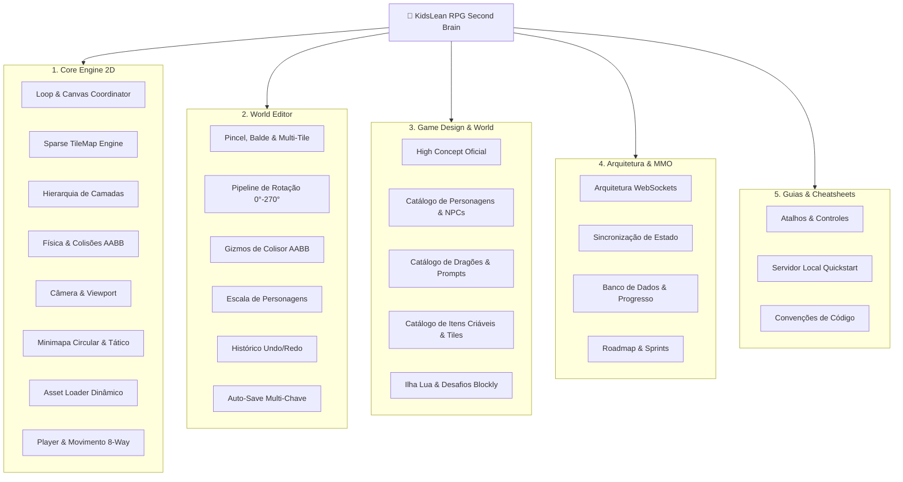

# 🧠 Geralt's Realm & Ilha Lua — Second Brain (Obsidian Hub)

> [!abstract] Bem-vindo ao Second Brain do Projeto KidsLean / Geralt's Realm RPG & MMO Educativo
> Este cofre (Vault) serve como base de conhecimento centralizada, documentando arquitetura do motor 2D, ferramentas do editor de mundos, pipeline de assets, visão MMO e trilha educativa de programação.

---

## 🗺️ Map of Content (MOC)

---

## 📂 Navegação por Módulos

### 1. ⚙️ [[Game Loop & Canvas Coordinator|Core Engine 2D]]
* [[Game Loop & Canvas Coordinator]] — Loop com delta-time, escalonamento e coordenação de subsistemas.
* [[TileMap & Sparse Grid Engine]] — Estrutura de dados esparsa infinita indexada por coordenadas `x,y`.
* [[Layer Hierarchy & Dynamic Stacking]] — Pilha de renderização reordenável (Chão, Decoração, Sólido, Personagens).
* [[Mount & Modular Character Layering System]] — Sistema de sockets de montaria (posicionamento do herói sobre qualquer dragão).
* [[Dialogue & Animal Crossing Speech Bubble System]] — Interface de diálogos com NPCs e chat flutuante empilhável (max 2) estilo Animal Crossing.
* [[Collision Detection & AABB Math]] — Algoritmos de colisão com suporte a rotação 90°/180°/270° e deslizamento de cantos.
* [[Camera & Infinite Viewport]] — Câmera com interpolação suave, zoom matricial e conversão Screen-to-World.
* [[Circular & Expanded Tactical Minimap]] — Radar de bússola circular, mapa tático expandido.
* [[Asset Discovery & Dynamic Loader]] — Scanner assíncrono de diretórios e inferência automática de dimensões.
* [[Player Entity & 8-Way Movement]] — Máquina de estados do Geralt, sprites direcionais e colisor dos pés.

### 2. 🛠️ [[Brush, Fill & Multi-Tile Placement|World Editor & Ferramentas]]
* [[Brush, Fill & Multi-Tile Placement]] — Pincel inteligente de pegada multi-célula (`gridW x gridH`) e flood fill.
* [[Asset Rotation Pipeline (0°, 90°, 180°, 270°)]] — Matemática de rotação de pegadas e reposicionamento de colisores.
* [[Interactive Collider Box Gizmos]] — Arrastar e redimensionar caixas de colisão diretamente na tela.
* [[Character Scale & Entity Manager]] — Ajuste dinâmico de tamanho de entidades (0.2x a 5.0x) com persistência.
* [[Undo-Redo History Manager (50 States)]] — Pilha de snapshots profundos com suporte a Ctrl+Z e Ctrl+Y.
* [[State Persistence & Auto-Save Protocol]] — Sistema de salvamento resiliente multi-chave no localStorage.

### 3. 🎨 [[00 - High Concept & Game Vision|Game Design & Lore]]
* [[00 - High Concept & Game Vision]] — High Concept oficial: 2 Modos, Trilha de Missões Lua e Sistema de Dragões.
* [[Lua Missions Script & Interactive Field Moves]] — Roteiro de missões pedagógicas de programação Lua e Field Moves de interação com cenário.
* [[Catalog - Characters, NPCs & Generation Prompts]] — 8 Heróis jogáveis, Moradores NPCs, habilidades únicas e prompts de vetor 3D/Animal Crossing.
* [[Catalog - Dragons, Species & Generation Prompts]] — Catálogo de dragões (voadores, terrestres, aquáticos e míticos) com atributos e prompts.
* [[Catalog - Craftable Items, Tiles & Generation Prompts]] — Inventário completo de itens criáveis, IDs, descrições e prompts de IA.
* [[Geralt's Realm Lore & Setting]] — Ambientação dark-fantasy lúdica, narrativa e identidade visual.
* [[Tile Assets & Biome Catalog]] — Inventário de terrenos, água animada, flora, estruturas e plantações.
* [[Characters, NPCs & Entities]] — Geralt, Villagers, Guardas e templates para inimigos.
* [[Lua Island Educational Gameplay (Blockly & Lua)]] — GDD do jogo MMO educativo com desafios de programação.

### 4. 🌐 [[Web MMO Client-Server Architecture|Arquitetura & Roadmap MMO]]
* [[Web MMO Client-Server Architecture]] — Estrutura de microserviços e estado sincronizado.
* [[Multiplayer Synchronization (WebSockets)]] — Loop de rede, reconciliação de estado e interpolação.
* [[Database & Account State Schema]] — Modelagem relacional/documental para inventário, housing e progresso.
* [[Milestones & Sprint Roadmap]] — Planejamento ágil por sprints para expansão 3D e multiplayer.

### 5. 📖 [[Keyboard Shortcuts & Controls Cheatsheet|Guias & Cheatsheets]]
* [[Keyboard Shortcuts & Controls Cheatsheet]] — Tabela completa de atalhos do teclado no Play e Edit Mode.
* [[Local Server & Deployment Quickstart]] — Como rodar localmente (`start.sh`, `start.command`, `npm start`).
* [[Developer Workflow & Coding Conventions]] — Padrões arquiteturais ES6 Modules, Vanilla JS e CSS Tokens.

---

## 🏷️ Tags do Cofre
#engine #editor #gamedev #architecture #lore #mmo #lua #shortcuts #roadmap
