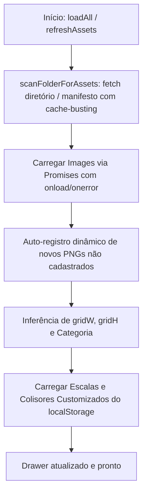

# 📦 Asset Discovery & Dynamic Loader

#engine #assets #loader #spritesheet #crawler

> **Arquivo Fonte**: [`src/engine/AssetLoader.js`](file:///Volumes/SSD%20FN501%20PRO/KidsLean/src/engine/AssetLoader.js)

---

## 🎯 Visão Geral
O `AssetLoader` é responsável por:
1. **Pré-carregamento Assíncrono com Barra de Progresso**.
2. **Scanner Dinâmico de Diretórios & Manifesto com Cache-Busting**:
   - Detecta novos arquivos `.png` adicionados à pasta `RPG-overworld-tileset/` em tempo de execução através do botão *"Atualizar"*.
   - Lê tanto `assets-manifest.json` quanto a listagem de diretório via web server sem cache (`?t=timestamp`), auto-registrando novos tiles imediatamente no drawer.
3. **Inferência Inteligente de Metadados**:
   - Calcula automaticamente `gridW` e `gridH` dividindo a resolução da imagem por `64`.
   - Categoriza automaticamente entre *Terrain*, *Water*, *Nature*, *Structures*, *Farming*, *Colliders* e *Characters*.
   - Atribui colisores padrões proporcionais para estruturas sólidas.
4. **Encaixe Perfeito na Grid (Seamless Snapping)**:
   - Os tiles e spritesheets são renderizados ocupando exatamente múltiplos de `64px` na grid, garantindo conexão contínua e sem fendas com tiles vizinhos.
5. **Gerenciamento de Escala de Personagens e Custom Colliders** salvos no localStorage.

---

## 📂 Diretórios de Imagens

| Caminho | Conteúdo |
| :--- | :--- |
| `Geralt/Idle/rotations/*.png` | 8 rotações de sprite em repouso (Sul, Sudeste, Leste, Nordeste, Norte, Noroeste, Oeste, Sudoeste) |
| `Geralt/running/rotations/*.png` | 8 rotações de sprite em corrida |
| `RPG-overworld-tileset/*.png` | Terrenos, árvores, casas, detalhes, plantações |
| `RPG-overworld-tileset/water animation/*.png` | Sequência de 8 frames para água corrente |

---

## 🔗 Links Relacionados
* [[Tile Assets & Biome Catalog]]
* [[Player Entity & 8-Way Movement]]
* [[Interactive Collider Box Gizmos]]
