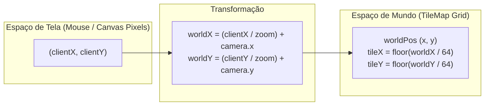

# 🎥 Camera & Infinite Viewport

#engine #camera #viewport #math #coordinates

> **Arquivo Fonte**: [`src/engine/Camera.js`](file:///Volumes/SSD%20FN501%20PRO/KidsLean/src/engine/Camera.js)

---

## 🎯 Visão Geral
A classe `Camera` gerencia a matriz de visualização 2D do Canvas, suportando:
1. **Rastreamento Suave com Interpolação Linear (LERP)**: Acompanhamento elástico do Geralt no Play Mode.
2. **Navegação Livre com Pan e Zoom**: Zoom dinâmico de `0.5x` a `3.0x`.
3. **Transformação de Coordenadas Bidirecional**:
   - `worldToScreen(worldX, worldY)`
   - `screenToWorld(screenX, screenY)`

---

## 📐 Matemática de Transformação de Coordenadas

---

## 🎯 Centralização Imediata vs Suave
* **Interpolação Suave (Play Mode)**:
  `camera.follow(targetX, targetY, 0.1)` — move 10% da distância restante a cada quadro para sensação cinematográfica orgânica.
* **Centralização Instantânea (`[F]` ou Troca de Modo)**:
  `camera.follow(targetX, targetY, 1.0)` — teleporta a câmera instantaneamente para o centro do jogador.

---

## 🔗 Links Relacionados
* [[Game Loop & Canvas Coordinator]]
* [[Circular & Expanded Tactical Minimap]]
* [[Brush, Fill & Multi-Tile Placement]]
