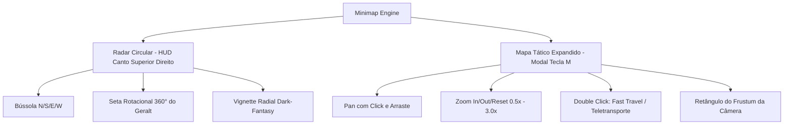

# 🧭 Circular & Expanded Tactical Minimap

#engine #ui #minimap #cartography #hud

> **Arquivo Fonte**: [`src/engine/Minimap.js`](file:///Volumes/SSD%20FN501%20PRO/KidsLean/src/engine/Minimap.js)

---

## 🎯 Modos do Minimapa



---

## 🎨 Paleta de Cores Cartográfica Rápida
Para garantir 60 FPS ininterruptos mesmo em mapas com milhares de tiles, o Minimapa utiliza uma tabela direta de cores em hexadecimal simplificada:

```javascript
this.tileColorMap = {
  'water-animated': '#2563eb', // Azul oceano
  'grass': '#15803d',          // Verde gramado
  'tree-1': '#064e3b',         // Verde musgo escuro
  'house-1': '#b91c1c',        // Vermelho telhado
  'dirt-path': '#b45309',      // Marrom terra
  'character-geralt': '#f59e0b'// Ouro vibrante
};
```

---

## ⚡ Viagem Rápida (Fast Travel)
Ao abrir o mapa tático expandido (`[M]`), dar duplo clique em qualquer região do território teleporta instantaneamente o Geralt e a câmera para o ponto clicado:

```javascript
const targetWorldX = (clickX / (this.expandedZoom * 0.2)) + this.player.x;
const targetWorldY = (clickY / (this.expandedZoom * 0.2)) + this.player.y;
this.player.setSpawn(targetWorldX, targetWorldY);
```

---

## 🔗 Links Relacionados
* [[Camera & Infinite Viewport]]
* [[Player Entity & 8-Way Movement]]
* [[Tile Assets & Biome Catalog]]
