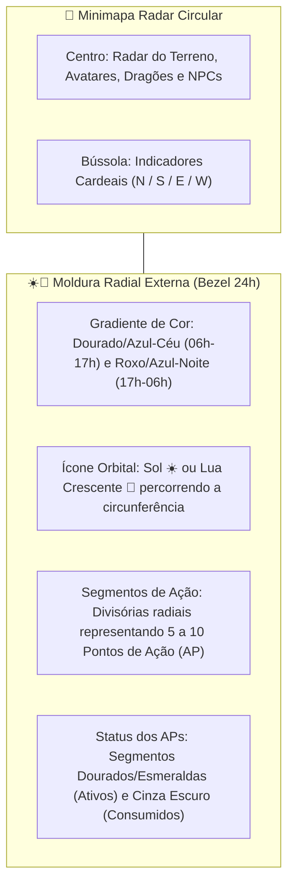

# 🧭 Circular Minimap com Anel Radial de Dia/Noite & Barra de Ações

#engine #ui #minimap #cartography #hud #daynight #actions

> **Arquivo Fonte**: [`src/engine/Minimap.js`](file:///Volumes/SSD%20FN501%20PRO/KidsLearnCode/src/engine/Minimap.js)  
> **Conceito:** O Minimapa Circular no canto da tela é o centro integrado de navegação tática e temporização diária, contornado por uma **moldura radial (Bezel)** que exibe o ciclo de Sol/Lua e a divisão dos **Pontos de Ação (AP)** em segmentos luminosos.

---

## 1. 🎯 Anatomia Visual do Minimapa Integrado



---

## 2. 🎨 Design do Anel Circular (Action & Celestial Dial)

```
             [ N ]   ☀️ (14:35)
          . - ~ ~ ~ - .
      . '   |   |   |   ' .      <-- Segmentos de Ação (AP)
    /   ■   |   ■   |   ■   \
   |  [W]    Radar do    [E] |
    \   ■   |   ■   |   □   /    <-- (□ = Ação gasta / ■ = Ação ativa)
      . '   |   |   |   ' .
          ' - _ _ _ - '
             [ S ]
```

### 2.1. Elementos da Moldura Radial:
1. **Ícone Orbital (Sol / Lua):**
   * Uma miniatura do **Sol ☀️** (durante o dia das 06:00 às 17:00 de Brasília) ou **Lua 🌙** (durante a noite) orbita ao longo do perímetro circular acompanhando o horário do relógio real.
2. **Segmentos Radiais de Pontos de Ação (AP):**
   * O anel externo é fatiado por **linhas de divisão radiais discretas** em 5 partes iguais (podendo expandir para até 10 conforme o jogador evolui).
   * **Segmento Ativo (Disponível):** Preenchido com gradiente dourado/âmbar brilhante durante o dia (ou **púrpura luminescente** à noite para o Morcego Vampiro).
   * **Segmento Consumido (Gasto):** Fica com textura de pedra escura/translúcida, indicando que a ação já foi realizada.
3. **Feedback Instantâneo:** Ao passar o mouse sobre o anel do minimapa, um tooltip suave no estilo *Animal Crossing* exibe: `"☀️ 14:35 (Brasília) — 6/10 Ações Disponíveis"`.

---

## 3. 🛠️ Renderização no Canvas 2D (`Minimap.js`)

```javascript
export class Minimap {
  renderRadialActionDial(ctx, centerX, centerY, radius, currentAP, maxAP, isDay, brasiliaHour) {
    const startAngle = -Math.PI / 2; // Topo (12 horas)
    const arcStep = (Math.PI * 2) / maxAP;

    ctx.save();
    ctx.lineWidth = 10;

    // 1. Desenha cada fatia/segmento de Ação (AP)
    for (let i = 0; i < maxAP; i++) {
      const segStart = startAngle + (i * arcStep) + 0.04;
      const segEnd = startAngle + ((i + 1) * arcStep) - 0.04;

      ctx.beginPath();
      ctx.arc(centerX, centerY, radius + 8, segStart, segEnd);

      if (i < currentAP) {
        ctx.strokeStyle = isDay ? '#f59e0b' : '#8b5cf6'; // Dourado no dia / Púrpura à noite
        ctx.shadowColor = isDay ? '#fbbf24' : '#a78bfa';
        ctx.shadowBlur = 6;
      } else {
        ctx.strokeStyle = '#27272a'; // Cinza escuro (Gasto)
        ctx.shadowBlur = 0;
      }
      ctx.stroke();
    }

    // 2. Desenha o Ícone Orbital de Sol / Lua
    const sunAngle = startAngle + (brasiliaHour / 24) * Math.PI * 2;
    const celestialX = centerX + Math.cos(sunAngle) * (radius + 20);
    const celestialY = centerY + Math.sin(sunAngle) * (radius + 20);

    ctx.fillStyle = isDay ? '#fbbf24' : '#c084fc';
    ctx.beginPath();
    ctx.arc(celestialX, celestialY, 7, 0, Math.PI * 2);
    ctx.fill();

    ctx.restore();
  }
}
```

---

## 4. 🗺️ Modo do Mapa Tático Expandido (`Tecla M`)
* Ao pressionar **`M`**, abre a visualização cartográfica ampliada da ilha completa, exibindo biomas descobertos, marcos de NPCs e áreas de ninhos de dragão exploradas.

---

## 🔗 Links Relacionados
* [[Day Night Cycle & Action Points System]]
* [[Camera & Infinite Viewport]]
* [[Game Loop & Canvas Coordinator]]
