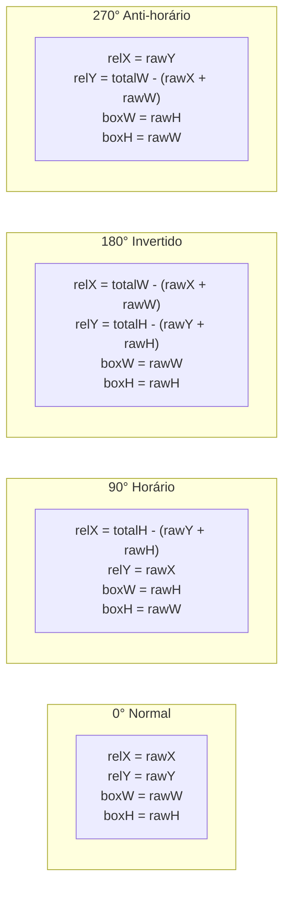

# 💥 Collision Detection & AABB Math

#engine #physics #math #collision #algorithms

> **Arquivos Fonte**: [`src/engine/Player.js`](file:///Volumes/SSD%20FN501%20PRO/KidsLean/src/engine/Player.js) & [`src/editor/EditorController.js`](file:///Volumes/SSD%20FN501%20PRO/KidsLean/src/editor/EditorController.js)

---

## 🦶 Colisor dos Pés do Jogador (Feet Collider)
Para garantir profundidade 2D isométrica onde a cabeça do personagem pode passar por trás de copas de árvores ou telhados sem colidir, o colisor do jogador é restrito à base dos pés:

```javascript
getFeetBox(px = this.x, py = this.y) {
  const s = this.scale;
  return {
    x: px + (this.collider.offsetX * s),
    y: py + (this.collider.offsetY * s),
    w: this.collider.width * s,
    h: this.collider.height * s
  };
}
```

---

## 🔄 Transformação Geométrica de Colisores com Rotação
Quando um objeto multi-tile ou estrutura é rotacionado em 90°, 180° ou 270°, a caixa do colisor interno (`rawX, rawY, rawW, rawH`) é transformada geometricamente em relação ao footprint total (`totalW, totalH`):



---

## 🏄 Deslizamento Suave de Cantos (Corner Sliding)
Em vez de testar `(x + dx, y + dy)` como um vetor único rígido, o motor executa testes independentes para o eixo **X** e para o eixo **Y**:

```javascript
// 1. Tenta movimento em X
const targetX = this.x + dx;
if (!this.checkCollision(targetX, this.y, tileMap, assetLoader) || currentColliding) {
  this.x = targetX;
}

// 2. Tenta movimento em Y
const targetY = this.y + dy;
if (!this.checkCollision(this.x, targetY, tileMap, assetLoader) || currentColliding) {
  this.y = targetY;
}
```
*Se o jogador andar na diagonal contra uma parede horizontal, o movimento no eixo X deslizará suavemente.*

---

## 🛡️ Sistema Anti-Travamento (Unstuck Detection)
Se um objeto for pintado diretamente sobre o jogador durante o modo de edição, `currentColliding = true` permite que o jogador se mova livremente para fora da colisão em vez de ficar congelado permanentemente.

---

## 🔗 Links Relacionados
* [[Player Entity & 8-Way Movement]]
* [[Interactive Collider Box Gizmos]]
* [[Asset Rotation Pipeline (0°, 90°, 180°, 270°)]]
