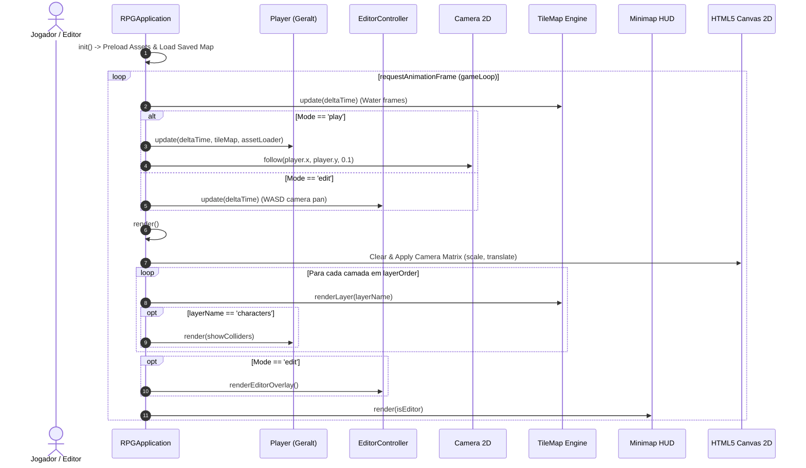

# 🔄 Game Loop & Canvas Coordinator

#engine #architecture #canvas #performance

> **Arquivo Fonte**: [`src/main.js`](file:///Volumes/SSD%20FN501%20PRO/KidsLean/src/main.js)  
> **Classe Principal**: `RPGApplication`

---

## 🎯 Visão Geral
A classe `RPGApplication` é o maestro central do motor. Ela gerencia o ciclo de vida do jogo, coordena a troca de modos (**Play Mode** vs **World Editor**), orquestra o loop de renderização a 60 FPS com delta-time estável e gerencia a persistência contínua.



---

## ⏱️ Controle de Delta-Time e FPS
O loop calcula `deltaTime` limitado a 100ms para evitar saltos quânticos de física quando o usuário troca de aba:

```javascript
gameLoop(currentTime) {
  const deltaTime = Math.min(currentTime - this.lastTime, 100);
  this.lastTime = currentTime;

  // Contador de FPS
  this.frameCount++;
  this.fpsTimer += deltaTime;
  if (this.fpsTimer >= 1000) {
    document.getElementById('status-fps').innerText = this.frameCount;
    this.frameCount = 0;
    this.fpsTimer = 0;
  }
  ...
}
```

---

## 🔀 Alternância de Modos (Play vs Edit)

| Propriedade | Play Mode | World Editor Mode |
| :--- | :--- | :--- |
| **Foco de Controle** | Movimentação do Geralt (WASD) | Pan livre da Câmera (WASD / Pan do Mouse) |
| **Câmera** | Rastreamento elástico contínuo | Navegação livre desvinculada |
| **Drawer de Assets** | Oculto / Recolhido | Expandido com redimensionamento por mouse |
| **Colisores Invisíveis** | Totalmente transparentes | Marcados com listras e tag `BARRIER` |
| **Overlays** | Apenas HUD mínimo e Minimap | Grade infinita, Ghost preview e Gizmos |

---

## 🔗 Links Relacionados
* [[TileMap & Sparse Grid Engine]]
* [[Camera & Infinite Viewport]]
* [[Layer Hierarchy & Dynamic Stacking]]
* [[State Persistence & Auto-Save Protocol]]
