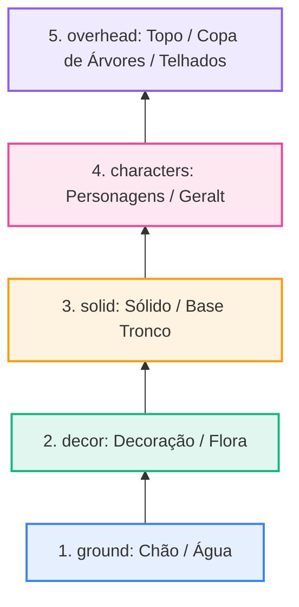

# 📚 Hierarquia de Camadas & Dynamic Stacking

#engine #layers #rendering #ui

> **Arquivo Fonte**: [`src/engine/TileMap.js`](file:///Volumes/SSD%20FN501%20PRO/KidsLean/src/engine/TileMap.js) & [`src/main.js`](file:///Volumes/SSD%20FN501%20PRO/KidsLean/src/main.js)

---

## 🎨 As 5 Camadas do Mundo

| Camada | ID | Atalho | Cor Badge | Função no Cenário | Exemplos |
| :--- | :--- | :---: | :---: | :--- | :--- |
| **Chão** | `ground` | `1` | 🔵 `#3b82f6` | Terreno base e água | Água animada, oceanos, rampas base |
| **Decoração** | `decor` | `2` | 🟢 `#10b981` | Flora rasteira, caminhos, detalhes | Grama alta, estradas de terra, flores |
| **Sólido** | `solid` | `3` | 🟠 `#f59e0b` | Obstáculos, casas, base de troncos | Base de árvores, paredes, caixas, pedras |
| **Personagens** | `characters` | `4` | 🟣 `#ec4899` | Entidades dinâmicas e avatares | Geralt (Spawn), NPCs, Inimigos |
| **Topo / Cobertura** | `overhead` | `5` | 🔮 `#8b5cf6` | Elementos acima da cabeça do player | Copa de árvores (folhagens), telhados, arcos |

---

## 🌲 Efeito de Profundidade 2.5D (Árvores & Casas Inteiras com Y-Sorting)
O motor conta com **2 métodos flexíveis** para lidar com sobreposição e profundidade:

### Método 1: Y-Sorting Automático & Manipulável (Asset Único)
Para árvores inteiras, casas e estruturas completas na camada **Sólido (`3`)**:
- O motor renderiza o jogador e os objetos sólidos ordenados pela **Linha de Base Y (Pé do objeto)**.
- **Como Manipular no Editor**:
  1. Selecione o asset ou célula com a ferramenta **Colisor (<kbd>C</kbd>)** ou **Select (<kbd>V</kbd>)**.
  2. No painel inferior, use o slider **"Linha de Base 2.5D (Pé / Profundidade)"** (0% = topo da imagem, 100% = base da imagem).
  3. Ou clique no botão **Auto** para alinhar automaticamente com o colisor do tronco/parede.
  4. Uma linha tracejada roxa (**`▼ 2.5D BASE`**) é desenhada no mapa indicando o ponto de corte de profundidade em tempo real.
- **Resultado em Jogo**:
  - Quando o Geralt está acima da linha (Y menor), ele passa **por trás** da copa/telhado.
  - Quando o Geralt está abaixo da linha (Y maior), ele passa **na frente** da base/tronco.

### Método 2: Separação em Camadas (Camada 5 Topo / Overhead)
Para assets que já estão em pedaços separados:
1. Pinte o tronco na camada **Sólido (`3`)**.
2. Pinte o topo na camada **Topo (`5`)**.

---

## ↕️ Reordenação Dinâmica da Pilha (Stack Manager)
O usuário pode alterar livremente a ordem visual de renderização através do botão **"Ordem"** no drawer de assets:



### Algoritmo de Troca:
```javascript
moveLayer(layerId, direction) {
  const idx = this.layerOrder.indexOf(layerId);
  if (idx === -1) return false;
  if (direction === 'up' && idx < this.layerOrder.length - 1) {
    const temp = this.layerOrder[idx];
    this.layerOrder[idx] = this.layerOrder[idx + 1];
    this.layerOrder[idx + 1] = temp;
    return true;
  } else if (direction === 'down' && idx > 0) {
    const temp = this.layerOrder[idx];
    this.layerOrder[idx] = this.layerOrder[idx - 1];
    this.layerOrder[idx - 1] = temp;
    return true;
  }
  return false;
}
```

---

## 🔍 Inspetor Multi-Camadas por Célula
Ao usar a ferramenta **Select** em qualquer quadrado do mapa, o painel do inspetor decompõe verticalmente o que está presente em cada camada naquela coordenada exata `[X, Y]`, permitindo:
1. **Girar** o tile daquela camada específica (+90°).
2. **Selecionar** o tile para o pincel ativo.
3. **Apagar** apenas o elemento daquela camada específica sem destruir o chão ou a árvore abaixo/acima.

---

## 🔗 Links Relacionados
* [[TileMap & Sparse Grid Engine]]
* [[Interactive Collider Box Gizmos]]
* [[Brush, Fill & Multi-Tile Placement]]
