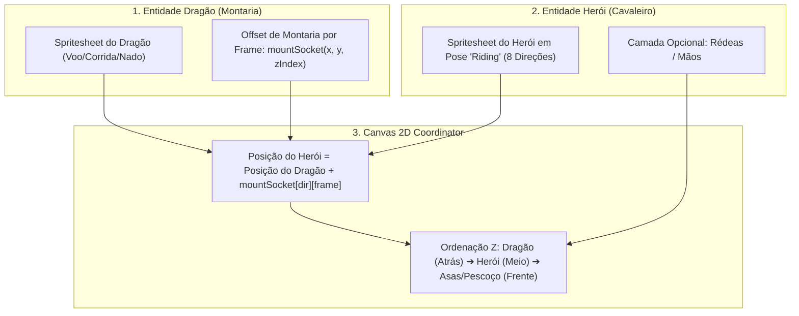

# 🏇 Sistema Modular de Montarias e Camadas Dinâmicas (Socket & Anchor System)

#engine #mounts #dragons #rendering #architecture #animation

> **Objetivo:** Resolver a sobreposição e animação de 8+ personagens jogáveis sobre qualquer dragão/montaria sem explosão combinatória de spritesheets, mantendo harmonia visual perfeita.

---

## 1. ⚠️ O Desafio da "Explosão Combinatória"

Se tentássemos gerar um spritesheet pré-renderizado para cada combinação de herói montado em cada dragão:
$$\text{8 Heróis} \times \text{10 Dragões} \times \text{8 Direções} \times \text{6 Frames} = 3.840 \text{ sprites únicos (Centenas de planilhas de sprites)!}$$

Qualquer ajuste de roupa ou novo dragão exigiria gerar e alinhar dezenas de novos arquivos.

---

## 2. 💡 A Solução: Renderização Modular por Sockets (Padrão da Indústria)

Em vez de fundir imagens, separamos o sistema em **2 entidades coordenadas com pontos de âncora (Sockets)**:



---

## 3. 🎨 Harmonização Visual (Dragões no Estilo Animal Crossing / Sea of Stars)

Para que o personagem e o dragão pareçam feitos para o mesmo universo:
1. **Mesma Estética Animal Crossing:** Formas arredondadas, traços fofos, olhos expressivos, texturas táteis e amigáveis.
2. **Mesma Perspectiva de Câmera:** Ângulo 3/4 Top-Down elevado (estilo *Sea of Stars*).
3. **Mesma Renderização 2.5D:** Arte vetorial nítida com iluminação suave tipo "brinquedo de vinil / clay render 3D", sombras de oclusão de ambiente e sem pixel art.
4. **Área de Assento Anatômica:** Todo dragão possui um dorso/sela visível e nivelado onde o personagem se encaixa perfeitamente.

---

## 4. 📐 Especificação Técnica dos Sockets no Motor

No arquivo de metadados (`metadata.json`) de cada dragão, definimos o ponto exato onde a cintura do personagem se conecta para cada direção e frame da animação:

```json
{
  "dragonId": "dragon_fly_zephyr",
  "mountSocket": {
    "south": [
      { "frame": 0, "x": 0, "y": -14, "heroZIndex": 1 },
      { "frame": 1, "x": 0, "y": -16, "heroZIndex": 1 },
      { "frame": 2, "x": 0, "y": -14, "heroZIndex": 1 },
      { "frame": 3, "x": 0, "y": -12, "heroZIndex": 1 }
    ],
    "north": [
      { "frame": 0, "x": 0, "y": -18, "heroZIndex": -1 },
      { "frame": 1, "x": 0, "y": -20, "heroZIndex": -1 }
    ],
    "east": [
      { "frame": 0, "x": -6, "y": -15, "heroZIndex": 1 },
      { "frame": 1, "x": -6, "y": -17, "heroZIndex": 1 }
    ],
    "west": [
      { "frame": 0, "x": 6, "y": -15, "heroZIndex": 1 },
      { "frame": 1, "x": 6, "y": -17, "heroZIndex": 1 }
    ]
  }
}
```

### 🔁 Sincronização e Balanço (Bobbing Effect)
* Conforme o dragão bate as asas ou dá passos, os valores de `y` nos frames do socket variam levemente (-14px, -16px, -12px).
* O herói montado acompanha o balanço natural da montaria em tempo real sem precisar de animações extras.

---

## 5. 🎭 Sprites Necessários para os Heróis (Conjunto 'Riding')

Para cada um dos 8 heróis jogáveis, basta gerar **apenas 1 conjunto de poses de montaria**:
* **Pose `mount_idle` (8 direções):** Herói sentado com as perninhas abertas para a montaria, segurando rédeas/crina.
* **Pose `mount_gallop / mount_fly` (8 direções):** Herói levemente inclinado para frente em postura aerodinâmica, com capa/cabelo balançando suavemente.

---

## 🔗 Links Relacionados
* [[Catalog - Dragons, Species & Generation Prompts]]
* [[Catalog - Characters, NPCs & Generation Prompts]]
* [[Layer Hierarchy & Dynamic Stacking]]
* [[Player Entity & 8-Way Movement]]
