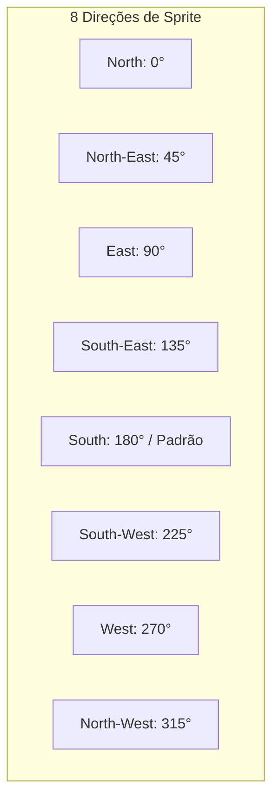

# ⚔️ Player Entity & 8-Way Movement

#engine #player #movement #animation #entity

> **Arquivo Fonte**: [`src/engine/Player.js`](file:///Volumes/SSD%20FN501%20PRO/KidsLean/src/engine/Player.js)

---

## 🎯 Máquina de Estados e Movimento 8-Way
O avatar do Geralt se movimenta a uma velocidade configurada de **220 px/s**, calculando a direção angular através de `Math.atan2(vy, vx)` dividida em 8 setores de 45°:



---

## 🏃 Normalização de Vetor Diagonal
Para evitar que o personagem ande $\sqrt{2} \approx 1.414$ vezes mais rápido ao pressionar simultaneamente $W + D$ ou $S + A$, o vetor é normalizado dividindo por $\sqrt{2}$:

```javascript
if (vx !== 0 && vy !== 0) {
  const length = Math.SQRT2;
  vx /= length;
  vy /= length;
}
```

---

## 📏 Renderização de Sombra e Escala
* **Sombra Elíptica Dinâmica**: Projetada abaixo dos pés do personagem, ajustando-se automaticamente ao multiplicador de escala (`scale`):
  ```javascript
  ctx.ellipse(this.x + (32 * s), this.y + (56 * s), 16 * s, 6 * s, 0, 0, Math.PI * 2);
  ```
* **Wireframe de Colisão Opcional**: Exibido em verde translúcido (`#10b981`) quando a opção *Colliders* está ativada.

---

## 🔗 Links Relacionados
* [[Collision Detection & AABB Math]]
* [[Asset Discovery & Dynamic Loader]]
* [[Character Scale & Entity Manager]]
