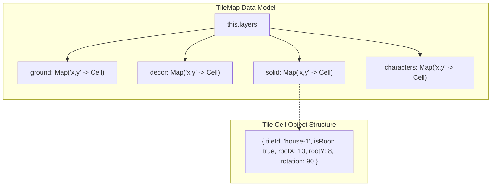

# 🗺️ TileMap & Sparse Grid Engine

#engine #datastructure #tilemap #grid #math

> **Arquivo Fonte**: [`src/engine/TileMap.js`](file:///Volumes/SSD%20FN501%20PRO/KidsLean/src/engine/TileMap.js)  
> **Constante Global**: `TILE_SIZE = 64` (pixels)

---

## 🏗️ Arquitetura Esparsa (Sparse Map)
Diferente de matrizes 2D fixas tradicionais (`Array[Y][X]`) que exigem pré-alocação de memória e limitam o tamanho do mapa, o motor KidsLean utiliza **Sparse Hash Maps** indexados por chaves de texto compostas: `"${x},${y}"`.

### Vantagens:
1. **Mundo Infinito**: Coordenadas podem crescer livremente em direções positivas ou negativas (`-500` a `+500`).
2. **Consumo de Memória O(N)**: Apenas células com tiles reais ocupam espaço na memória.
3. **Acesso O(1)**: `tileMap.getTile(layer, x, y)` executa busca direta em Hash Map.



---

## 📐 Estruturas Multi-Tile e Células Raiz (Root Cells)
Objetos que ocupam mais de 1 célula (ex: *Cottage House 4x4*, *Pine Tree 2x3*):
* A célula superior esquerda é marcada com `isRoot = true`.
* Todas as células ocupadas pela extensão (`dx, dy`) recebem `isRoot = false`, apontando para `rootX` e `rootY`.
* Durante a renderização, **apenas a célula raiz desenha a imagem**, evitando sobreposição redundante de texturas.
* Durante a exclusão, `deleteTile(x, y)` identifica o `rootX, rootY` e limpa toda a área ocupada.

---

## ⚡ Culling de Visibilidade no Viewport
O motor calcula exatamente quais colunas e linhas estão visíveis no retângulo da câmera, renderizando apenas as células necessárias com padding de segurança:

```javascript
const padding = 6;
const startCol = Math.floor(camera.x / this.tileSize) - padding;
const endCol = Math.ceil((camera.x + camera.viewportWidth / camera.zoom) / this.tileSize) + padding;
const startRow = Math.floor(camera.y / this.tileSize) - padding;
const endRow = Math.ceil((camera.y + camera.viewportHeight / camera.zoom) / this.tileSize) + padding;
```

---

## 🔗 Links Relacionados
* [[Layer Hierarchy & Dynamic Stacking]]
* [[Asset Rotation Pipeline (0°, 90°, 180°, 270°)]]
* [[Collision Detection & AABB Math]]
