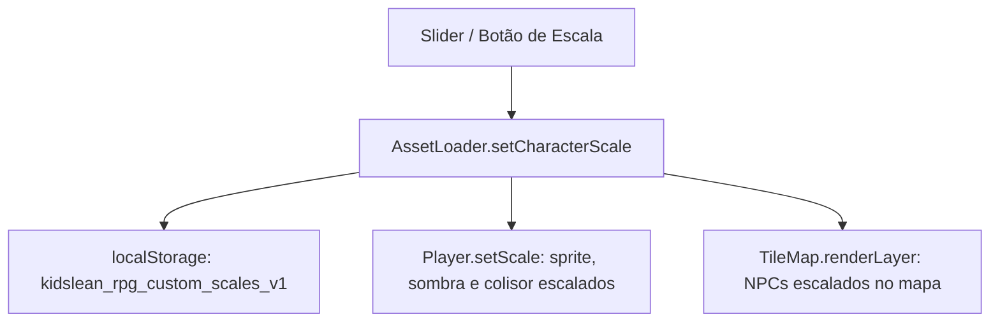

# 📏 Character Scale & Entity Manager

#editor #characters #entities #scale #sprites

> **Arquivos Fonte**: [`src/engine/Player.js`](file:///Volumes/SSD%20FN501%20PRO/KidsLean/src/engine/Player.js), [`src/engine/AssetLoader.js`](file:///Volumes/SSD%20FN501%20PRO/KidsLean/src/engine/AssetLoader.js) & [`src/main.js`](file:///Volumes/SSD%20FN501%20PRO/KidsLean/src/main.js)

---

## 🎯 Visão Geral
O sistema de escala permite redimensionar dinamicamente o Geralt e quaisquer entidades NPCs entre **`0.2x`** (tamanho minúsculo/anão) e **`5.0x`** (gigante/titã).

---

## 🎛️ Controles no Painel de Propriedades
Ao selecionar qualquer personagem na categoria **Characters**:
* **Botões de Preset**: `0.5x`, `0.75x`, `1.0x` (Padrão), `1.25x`, `1.5x`, `2.0x`.
* **Slider Contínuo**: Ajuste milimétrico de precisão com passo de `0.05x`.

---

## 🧩 Efeito da Escala nos Elementos
1. **Sprite**: `renderW = width * scale`, `renderH = height * scale`.
2. **Sombra dos Pés**: `ellipse(x + 32*s, y + 56*s, 16*s, 6*s)`.
3. **Caixa de Colisão AABB**: A caixa do colisor é proporcionalmente escalada, garantindo que personagens gigantes colidam adequadamente com estruturas grandes.

---

## 🔗 Links Relacionados
* [[Player Entity & 8-Way Movement]]
* [[Collision Detection & AABB Math]]
* [[State Persistence & Auto-Save Protocol]]
