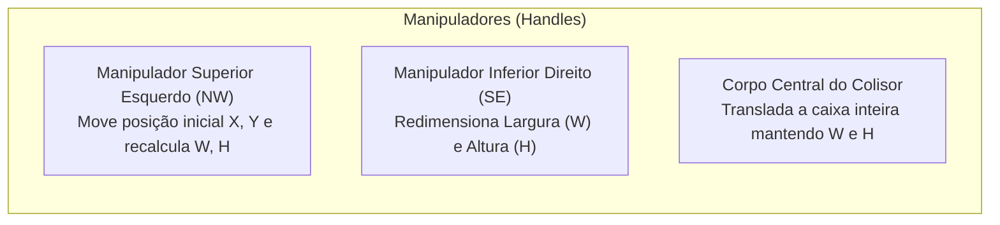

# 📐 Interactive Collider Box Gizmos

#editor #gizmos #collision #physics #ui

> **Arquivo Fonte**: [`src/editor/EditorController.js`](file:///Volumes/SSD%20FN501%20PRO/KidsLean/src/editor/EditorController.js)

---

## 🎯 Visão Geral
A ferramenta **Collider** permite aos desenvolvedores e level designers ajustar a física de qualquer objeto diretamente na tela via arrastar e soltar (drag-and-drop), sem necessidade de digitar números em caixas de diálogo.

---

## 🖱️ Mecânica de Interação
1. **Detecção de Clique no Gizmo**:
   `Math.abs(worldX - (boxX + boxW)) < handleRadius && Math.abs(worldY - (boxY + boxH)) < handleRadius`
2. **Atualização em Tempo Real**:
   Conforme o mouse é arrastado no Canvas, o evento `tile-collider-updated` é disparado, atualizando simultaneamente os campos numéricos da barra lateral e os limites físicos do objeto.
3. **Persistência Imediata**:
   O novo formato de colisão é gravado em `kidslean_rpg_custom_colliders_v1` no localStorage.

---

## 🛡️ Família de Colisores Invisíveis (Edge & L-Shape)
O catálogo de **Colliders** inclui os seguintes formatos prontos para uso em 1x1 e 2x2:
* **`Invisible Wall (1x1 Full)`**: Bloqueio total do grid (64x64px).
* **`Borda Superior (Top Edge)`**: Colisor apenas na borda de cima da célula.
* **`Borda Inferior (Bottom Edge)`**: Colisor na borda de baixo da célula.
* **`Borda Esquerda (Left Edge)`**: Colisor na borda esquerda da célula.
* **`Borda Direita (Right Edge)`**: Colisor na borda direita da célula.
* **`Canto L Superior Esquerdo (Top-Left L)`**: Colisor em formato de L fechando o canto superior esquerdo.
* **`Canto L Superior Direito (Top-Right L)`**: Colisor em L fechando o canto superior direito.
* **`Canto L Inferior Esquerdo (Bottom-Left L)`**: Colisor em L fechando o canto inferior esquerdo.
* **`Canto L Inferior Direito (Bottom-Right L)`**: Colisor em L fechando o canto inferior direito.
* **`Invisible Barrier (2x2)`**: Barreira ampla de 128x128px.

---

## 🎯 Edição Individual & Alternância de Visualização (Toggle)
* **Toggle de Visualização dos Colisores**:
  * No Modo Editor, ao clicar no botão **Colliders** do cabeçalho, na ferramenta **Collider** da barra lateral ou pressionar a tecla <kbd>C</kbd>, todos os limites de colisão (incluindo barreiras invisíveis, paredes e pés dos personagens) são destacados visualmente.
  * Ao clicar novamente no botão ou pressionar <kbd>C</kbd>, todos os limites de colisão são ocultados visualmente no mapa, mantendo a física ativa em background.
* **Play Mode 100% Imersivo**:
  * No Play Mode, todas as linhas de grade (grid), caixas de colisão, caixas invisíveis e gizmos são 100% removidos visualmente para máxima imersão visual dos jogadores.
* **Edição Individual de Colisores**:
  * Ao clicar em um objeto no mapa com a ferramenta Collider (<kbd>C</kbd>), o painel exibe `Collider: Nome [X: 12, Y: 34]`.
  * As alterações feitas nas alças arrastáveis ou nos inputs numéricos afetam apenas aquela instância específica, permitindo que dois assets iguais tenham formatos de colisão distintos.

---

## 🔗 Links Relacionados
* [[Collision Detection & AABB Math]]
* [[Character Scale & Entity Manager]]
* [[State Persistence & Auto-Save Protocol]]
