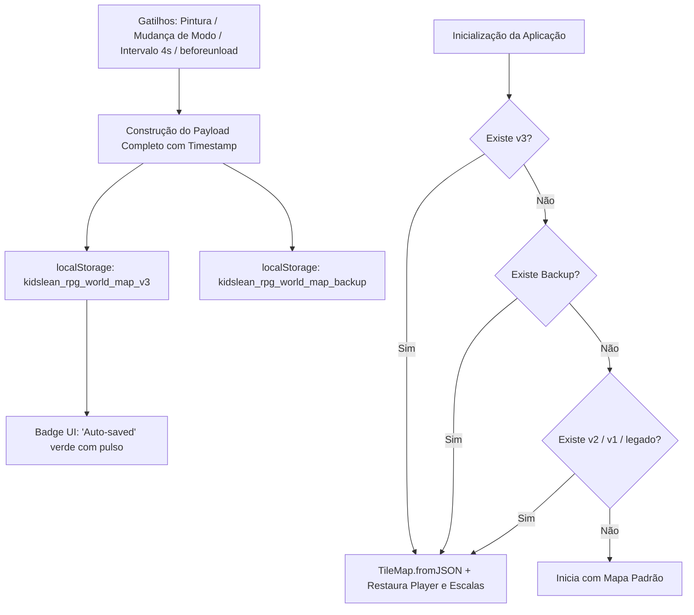

# 💾 State Persistence & Auto-Save Protocol

#editor #storage #persistence #autosave #json

> **Arquivos Fonte**: [`src/main.js`](file:///Volumes/SSD%20FN501%20PRO/KidsLean/src/main.js), [`src/engine/TileMap.js`](file:///Volumes/SSD%20FN501%20PRO/KidsLean/src/engine/TileMap.js) & [`src/engine/AssetLoader.js`](file:///Volumes/SSD%20FN501%20PRO/KidsLean/src/engine/AssetLoader.js)

---

## 🎯 Arquitetura de Persistência Resiliente



---

## 📦 Estrutura do Payload Serializado

```json
{
  "version": "3.3",
  "tileSize": 64,
  "spawnPoint": { "x": 300, "y": 300 },
  "player": { "x": 300, "y": 300, "scale": 1.0 },
  "layerOrder": ["ground", "decor", "solid", "characters"],
  "layers": {
    "ground": { "0,0": { "tileId": "water-animated", "isRoot": true, "rootX": 0, "rootY": 0, "rotation": 0 } },
    "decor": { "1,1": { "tileId": "tallGrass", "isRoot": true, "rootX": 1, "rootY": 1, "rotation": 0 } },
    "solid": { "4,4": { "tileId": "house-1", "isRoot": true, "rootX": 4, "rootY": 4, "rotation": 90 } },
    "characters": { "5,5": { "tileId": "character-npc-villager", "isRoot": true, "rootX": 5, "rootY": 5, "rotation": 0 } }
  },
  "savedAt": 1726484000000
}
```

---

## 📤 Exportação e Importação de Arquivos JSON
* **Salvar JSON**: Gera um arquivo `world-map-<timestamp>.json` para download, permitindo que o usuário guarde versões do mundo em seu computador ou compartilhe com outros desenvolvedores.
* **Carregar JSON**: Importa e valida qualquer arquivo `.json` gerado pelo editor, aplicando hot-reload no TileMap e no Minimapa.

---

## 🔗 Links Relacionados
* [[TileMap & Sparse Grid Engine]]
* [[Layer Hierarchy & Dynamic Stacking]]
* [[Character Scale & Entity Manager]]
