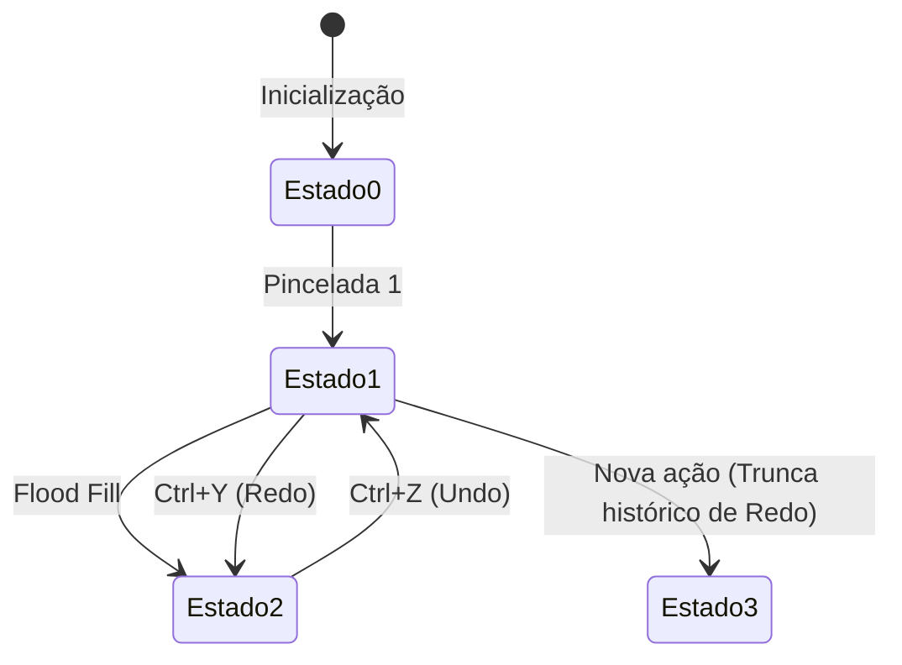

# ↩️ Undo-Redo History Manager (50 States)

#editor #history #undoredo #state #algorithms

> **Arquivo Fonte**: [`src/engine/UndoRedoManager.js`](file:///Volumes/SSD%20FN501%20PRO/KidsLean/src/engine/UndoRedoManager.js)

---

## 🎯 Visão Geral
O `UndoRedoManager` implementa uma pilha de reversão de histórico de até **50 estados** para o TileMap e ponto de spawn, garantindo que o designer possa experimentar livremente sem medo de perder alterações.

---

## ⚙️ Métodos Principais

| Método | Função |
| :--- | :--- |
| `recordState()` | Serializa o mapa com `JSON.stringify(tileMap.toJSON())`. Se o estado for idêntico ao anterior, descarta a gravação. |
| `undo()` | Recua o cursor `currentIndex--` e restaura o snapshot via `tileMap.fromJSON()`. |
| `redo()` | Avança o cursor `currentIndex++` e restaura o snapshot via `tileMap.fromJSON()`. |
| `updateUI()` | Habilita ou desabilita os botões de Undo/Redo na interface baseado em `canUndo()` e `canRedo()`. |

---

## ⌨️ Atalhos Suportados
* **Desfazer (Undo)**: `Ctrl + Z` ou `Cmd + Z`
* **Refazer (Redo)**: `Ctrl + Y`, `Cmd + Y` ou `Ctrl + Shift + Z`

---

## 🔗 Links Relacionados
* [[Brush, Fill & Multi-Tile Placement]]
* [[State Persistence & Auto-Save Protocol]]
