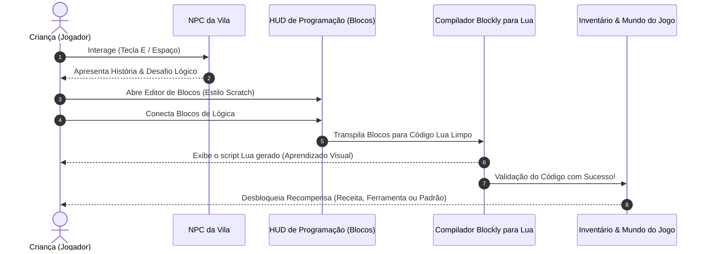
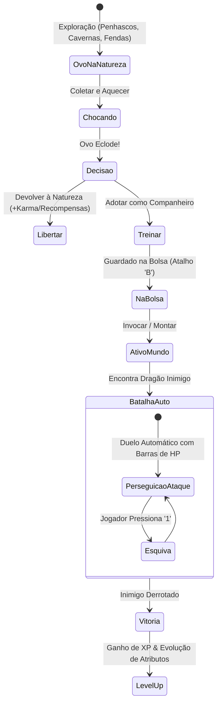

# 🐉 High Concept & Visão do Jogo: KidsLean (Ilha Lua)

#highconcept #gamedesign #lore #dragons #lua #mmo #overview

> **Gênero:** MMORPG Infantil / Simulação de Vida Medieval / EdTech  
> **Inspirações:** *Animal Crossing: New Horizons*, *Dragon Quest Builders*, *Scratch*, *Tibia/Pokemon Companion System*  
> **Documento Raiz:** [[HIGH_CONCEPT|HIGH_CONCEPT.md]]  

---

## 1. 🌟 Resumo Executivo & Visão do Jogo

O **KidsLean (Ilha Lua)** é um MMORPG medieval lúdico e educativo que combina a liberdade de exploração e convivência comunitária de *Animal Crossing* com a fascinação da domesticação e combate de dragões, movido por um motor de **aprendizado de programação em blocos (gerando código Lua)**.

O projeto opera sob uma arquitetura de dois modos rigorosamente separados:
1. **Modo Editor (Engine / Dev Only):** Ambiente restrito ao desenvolvedor para criação de mundos, pintura de biomas, desenho de colisões e posicionamento de entidades.
2. **Modo Play (MMORPG Sandbox):** O jogo real, onde crianças exploram a mesma ilha em tempo real, interagem com NPCs, resolvem desafios individuais de programação para desbloquear construções, coletam ovos e treinam dragões.

---

## 2. 🕹️ Os Dois Modos de Operação

### 2.1. 🛠️ Modo Editor (Ferramenta do Desenvolvedor)
* **Finalidade:** Funcionar como uma Game Engine integrada no navegador.
* **Acesso:** Exclusivo do desenvolvedor (bloqueado em builds de produção para jogadores).
* **Funcionalidades:**
  * Pincel, balde de preenchimento e posicionamento multi-tile de estruturas.
  * Pipeline de rotação de pegada (0°, 90°, 180°, 270°).
  * Criação e ajuste visual de caixas de colisão AABB (Gizmos interativos).
  * Definição de pontos de spawn de NPCs, monstros, pontos de mineração e ninhos de ovos de dragão.
  * Configuração de camadas de renderização (Chão, Decoração, Sólido, Personagens).

### 2.2. 🎮 Modo Play (Experiência das Crianças)
* **Finalidade:** O ambiente vivo do MMORPG medieval.
* **Mundo Compartilhado em Tempo Real:** Vários jogadores navegam pela mesma ilha, veem seus avatares e seus dragões companheiros simultaneamente.
* **Segurança & Foco:** Os jogadores **não possuem acesso** às ferramentas de edição do cenário. Toda modificação que o jogador faz no mundo (plantar sementes, colocar pontes ou cercados) ocorre via mecânicas legítimas do jogo desbloqueadas através das missões.

---

## 3. 📜 Sistema de Missões e Trilha Educativa (Lua em Blocos)

### 3.1. Progressão Individual Assíncrona
* Todos os jogadores compartilham o mesmo espaço físico na ilha, porém a **progressão de missões é estritamente pessoal**.
* Dois jogadores conversando com o mesmo NPC recebem a etapa correspondente ao seu próprio progresso individual (sem conflitos ou bloqueios de sala).

### 3.2. Tabela de Desbloqueios por Conquista Pedagógica

| Nível / Missão | Conceito de Programação | Exemplo em Lua | Recompensa Desbloqueada |
| :--- | :--- | :--- | :--- |
| **Missão 1** | Chamada de Funções & Variáveis | `meu_chao = "terra_batida"` `aplicar(meu_chao)` | **Padrões de Chão** (Caminhos de pedra, terra, grama florida) |
| **Missão 2** | Tipos de Dados & Equipamentos | `equipar("pa")` | **Ferramentas Básicas** (Pá, Machado de Lenhador, Vara de Pesca) |
| **Missão 3** | Condicionais (`if / then / else`) | `if energia >= 5 then` &nbsp;&nbsp;`cortar_arvore()` `end` | **Sementes & Agricultura** (Mudas de carvalho, pinheiros, arbustos e flores) |
| **Missão 4** | Laços de Repetição (`for / while`) | `for i=1, 6 do` &nbsp;&nbsp;`construir("cerca", i)` `end` | **Workbench - Estruturas** (Cercados, Pontes de Madeira, Escadas, Rampas) |
| **Missão 5** | Funções Customizadas & Parâmetros | `function erguer_abrigo(tipo)` &nbsp;&nbsp;`craft(tipo)` `end` | **Workbench - Habitação** (Cama, Cadeira, Tenda, Casa Medieval) |
| **Missão 6** | Manipulação de Eventos & Física | `on_water_flow(function()` &nbsp;&nbsp;`ativar_correnteza()` `end)` | **Padrões Animados** (Ladrilhos de Água Corrente, Lava Vulcânica) |

---

## 4. 🐉 Sistema de Dragões (Companheiros, Montarias & Batalhas)

* **Tipos de Montarias:** Voadores (sobrevoar rios e relevos), Terrestres (velocidade e quebra de pedras), Aquáticos (navegação marinha e fluvial).
* **Ninhos na Natureza:** Ovos coletados em penhascos, cavernas e buracos escavados.
* **Bolsa de Dragões (Tecla `B`):** Gerenciamento ágil de companheiros e montarias.
* **Combate Automático com Interação:** Dragões perseguem e atacam automaticamente; barras de HP visíveis sobre cada combatente (1v1 ou contra múltiplos inimigos).
* **Esquiva Tática (Tecla `1`):** Permite esquivar de ataques especiais em tempo real.
* **Treinamento e Níveis:** Vitória contra outros dragões concede XP e eleva atributos.

---

## 🔗 Links Relacionados
* [[00 - Hub & Map of Content (MOC)]]
* [[Lua Island Educational Gameplay (Blockly & Lua)]]
* [[Geralt's Realm Lore & Setting]]
* [[Keyboard Shortcuts & Controls Cheatsheet]]
