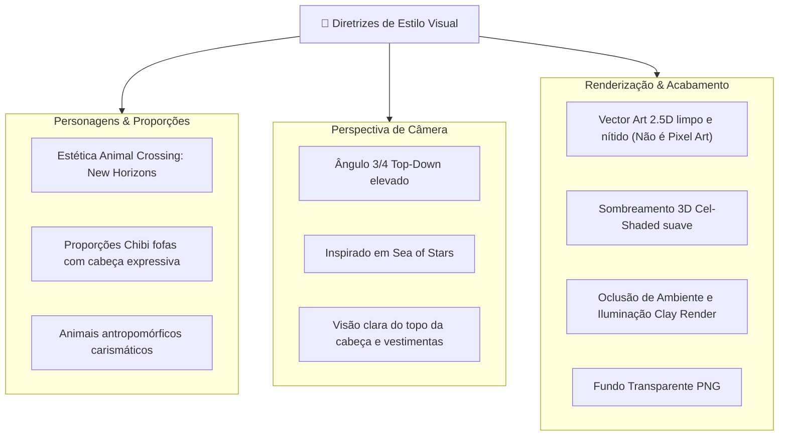

# 🐾 Catálogo Oficial de Personagens Jogáveis e NPCs (Design & Prompts)

> **Documento de Especificação de Heróis, Moradores da Ilha e Prompts de Geração de Arte**  
> **Diretriz Visual:** *Personagens antropomórficos adoráveis no estilo estético de **Animal Crossing: New Horizons** (proporções fofas 'chibi', olhos expressivos, vestimentas charmosas), renderizados em **Perspectiva 3/4 Top-Down (ângulo de visão elevado estilo Sea of Stars)**. Acabamento em **Vector Art 2.5D com sombreamento suave, oclusão de ambiente e iluminação 3D / Clay Render** (NÃO é pixel art).*

---

## 📋 Sumário do Catálogo

1. [🎨 Guia de Estilo Visual & Perspectiva](#1-🎨-guia-de-estilo-visual--perspectiva)
2. [🐺 Personagens Jogáveis — 4 Classes x 2 Gêneros = 8 Heróis](#2-🐺-personagens-jogáveis--4-classes-x-2-gêneros--8-heróis)
   * [2.1. Lobo — Caçador / Caçadora](#21-lobo--caçador--caçadora)
   * [2.2. Morcego — Vampiro / Vampira](#22-morcego--vampiro--vampira)
   * [2.3. Águia — Arqueiro / Arqueira](#23-águia--arqueiro--arqueira)
   * [2.4. Gato — Bruxo / Bruxa](#24-gato--bruxo--bruxa)
3. [🏝️ NPCs Principais da Ilha Lua](#3-🏝️-npcs-principais-da-ilha-lua)
   * [3.1. Tubarão — O Surfista](#31-tubarão--o-surfista-npc_shark_surfer)
   * [3.2. Jacaré — O Atravessador](#32-jacaré--o-atravessador-npc_alligator_ferryman)
   * [3.3. Macaco — O Mestre Construtor](#33-macaco--o-mestre-construtor-npc_monkey_builder)
   * [3.4. Camaleão — O Ilusionista Mágico](#34-camaleão--o-ilusionista-mágico-npc_chameleon_magician)
   * [3.5. Coruja — O Professor Ancião](#35-coruja--o-professor-ancião-npc_owl_professor)
4. [🏰 NPCs Complementares da Vila Medieval](#4-🏰-npcs-complementares-da-vila-medieval)
   * [4.1. Touro — O Ferreiro Forjador](#41-touro--o-ferreiro-forjador-npc_bull_blacksmith)
   * [4.2. Coelho — A Herbalista e Fazendeira](#42-coelho--a-herbalista-e-fazendeira-npc_rabbit_farmer)
   * [4.3. Tartaruga — O Guardião Ancestral](#43-tartaruga--o-guardião-ancestral-npc_turtle_elder)
   * [4.4. Pinguim — O Pescador Polar](#44-pinguim--o-pescador-polar-npc_penguin_angler)
5. [📊 Tabela Comparativa de Habilidades Únicas](#5-📊-tabela-comparativa-de-habilidades-únicas)

---

## 1. 🎨 Guia de Estilo Visual & Perspectiva



* **Prompt Base Style Tag (incorporado em todos os prompts):**  
  `Animal Crossing New Horizons aesthetic, cute anthropomorphic animal character, Sea of Stars high 3/4 top-down orthographic angle, 2.5D vector illustration with smooth 3D clay lighting, ambient occlusion, vibrant pastel fantasy palette, clean lines, isolated on transparent background, full body view`

### 🎭 Estados e Animações dos Personagens Jogáveis (8 Direções)
1. **`Idle` (8 direções):** Respiração suave com leve balanço de orelhas/penas.
2. **`Walk` (8 direções):** Passo firme e cadenciado de exploração (64px por tile).
3. **`Run / Sprint [Tecla Shift]` (8 direções):** Corrida veloz (+60% velocidade), postura inclinada aerodinâmica e pequenas nuvens fofas de poeira nos pés.
4. **`Craft / Build / Cast` (8 direções):** Animação de fabricação com martelo na bancada, rega de plantas ou conjuração mágica dos blocos Lua com brilho dourado nas mãos.
5. **`Mount Riding` (8 direções):** Pose sentada adaptada para encaixe milimétrico nos *sockets* de montaria dos dragões.

---

## 2. 🐺 Personagens Jogáveis — 4 Classes x 2 Gêneros = 8 Heróis

Cada jogador pode escolher livremente seu avatar inicial. Cada classe possui **1 Habilidade Passiva Única** que influencia a exploração e o vínculo com os dragões.

---

### 2.1. Lobo — Caçador / Caçadora
* **Arquétipo:** O Rastreador Destemido da Floresta.
* **Personalidade:** Leal, corajoso, enérgico e com instinto aguçado para aventuras ao ar livre.
* **Habilidade Única — `Faro Selvagem`:** Revela pegadas brilhantes no chão que apontam na direção de ovos de dragão ocultos e recursos raros a até 15 tiles de distância.

#### 🐺 Lobo Masculino (`char_wolf_hunter_m`)
* **Visual:** Pelagem cinza-chumbo com focinho creme fofo, orelhas pontudas atentas, olhos dourados calorosos, túnica de caçador de couro macio verde-floresta com cinto de fivela de bronze e pequena pena presa na touca.
* **Prompt de Geração:**
  > `Cute anthropomorphic wolf boy hunter character, Animal Crossing New Horizons art style, high 3/4 top-down perspective like Sea of Stars, charcoal-gray and cream fur, warm amber eyes, wearing a cozy forest-green leather ranger tunic with bronze buckle and tiny feather hat, clean vector art with smooth 3D lighting and soft ambient occlusion, crisp lines, full body, isolated on transparent background`

#### 🐺 Lobo Feminino (`char_wolf_hunter_f`)
* **Visual:** Pelagem branca-ártica com detalhes prateados, olhos azul-gelo curiosos e expressivos, lenço vermelho no pescoço sobre capa curta de batedora verde-oliva e botas de camurça com pelos fofos.
* **Prompt de Geração:**
  > `Cute anthropomorphic arctic wolf girl ranger character, Animal Crossing New Horizons art style, high 3/4 top-down camera angle like Sea of Stars, soft white and silver fur, expressive bright cyan eyes, wearing a red neck scarf over an olive-green scout capelet and fluffy fur boots, clean 2.5D vector illustration, soft 3D clay lighting, isolated on transparent background`

---

### 2.2. Morcego — Vampiro / Vampira
* **Arquétipo:** O Aristocrata Noturno e Alquimista.
* **Personalidade:** Culto, misterioso, refinado, amante da noite, de livros arcanos e de poções doces.
* **Habilidade Única — `Eco Noturno`:** Permite enxergar com clareza dentro de cavernas, concede **+5 Ações Noturnas exclusivas** durante a noite (após às 17h de Brasília, quando outros descansam) e +15% de velocidade de ataque noturno ao dragão companheiro.

#### 🦇 Morcego Masculino (`char_bat_vampire_m`)
* **Visual:** Pelagem roxo-escura aveludada, orelhas grandes triangulares com interior rosa suave, pequenos dentinhos pontudos adoráveis ao sorrir, elegante colete bordô com botões dourados e mini-capa preta de seda.
* **Prompt de Geração:**
  > `Cute anthropomorphic fruit bat boy vampire character, Animal Crossing New Horizons aesthetic, Sea of Stars elevated 3/4 top-down viewpoint, velvety dark plum-purple fur, oversized cute bat ears with soft pink inside, adorable tiny fang smile, wearing an elegant burgundy gentleman vest with gold buttons and silk black mini-cape, smooth 3D vector shading, clean lines, isolated on transparent background`

#### 🦇 Morcego Feminino (`char_bat_vampire_f`)
* **Visual:** Pelagem lilás suave com penugem no peito, asas membranosas charmosas presas aos bracinhos, vestido vitoriano preto e lilás com gola rendada branca e presilha de morcego de safira.
* **Prompt de Geração:**
  > `Cute anthropomorphic bat girl vampire noble character, Animal Crossing New Horizons style, Sea of Stars 3/4 top-down orthographic angle, pastel lilac fur with fluffy white chest fluff, cute wing arms, wearing a gothic-lolita black and purple medieval dress with white lace collar, smooth cel-shaded vector art with soft 3D ambient shadows, isolated on transparent background`

---

### 2.3. Águia — Arqueiro / Arqueira
* **Arquétipo:** O Sentinela Alado dos Cumes.
* **Personalidade:** Focado, observador, disciplinado, bem-humorado e apaixonado pela brisa das montanhas.
* **Habilidade Única — `Mira Perfeita`:** Aumenta a velocidade de coleta com a Vara de Pescar e Machado em 30%, além de recarregar a *Esquiva Tática (Tecla 1)* do dragão 1 segundo mais rápido.

#### 🦅 Águia Masculino (`char_eagle_archer_m`)
* **Visual:** Penas marrons com cabeça branca de águia-careca majestosa e fofa, bico dourado pequeno e amigável, gibão de arqueiro azul-celeste com protetor de ombro de couro e aljava miniatura de flechas nas costas.
* **Prompt de Geração:**
  > `Cute anthropomorphic eagle boy archer character, Animal Crossing New Horizons art style, high 3/4 top-down perspective like Sea of Stars, brown feathers with fluffy white head plumage, bright yellow beak, wearing a sky-blue medieval archer tunic with leather bracers and miniature arrow quiver on back, high-res clean vector art, soft 3D lighting and shadows, isolated on transparent background`

#### 🦅 Águia Feminina (`char_eagle_archer_f`)
* **Visual:** Penas de falcão dourado e creme, penugem estilosa como franja, olhos amendoados dourados, túnica de batedora em tons de turquesa e dourado com broche de asa de pássaro no peito.
* **Prompt de Geração:**
  > `Cute anthropomorphic golden falcon girl marksman character, Animal Crossing New Horizons aesthetic, Sea of Stars 3/4 top-down angle, golden-tan feathers with stylish crest feathers, sharp friendly gold eyes, wearing a teal and gold trimmed archer tunic with feather brooch, clean 2.5D vector illustration, 3D clay lighting, isolated on transparent background`

---

### 2.4. Gato — Bruxo / Bruxa
* **Arquétipo:** O Conjurador Místico e Estudioso de Lua.
* **Personalidade:** Curioso, brincalhão, místico, engenhoso e fascinado por resolver quebra-cabeças lógicos.
* **Habilidade Única — `Afinidade Arcana`:** Concede +10% de ganho de XP para os dragões domesticados e desbloqueia dicas automáticas nos desafios de programação Blockly.

#### 🐱 Gato Masculino (`char_cat_mage_m`)
* **Visual:** Pelagem de gato preto aveludado com patinhas brancas ("meias"), cauda longa ondulante com ponta dourada, túnica de feiticeiro azul-noite estrelada e pequeno chapéu pontudo tortinho com lua crescente.
* **Prompt de Geração:**
  > `Cute anthropomorphic black cat boy wizard character, Animal Crossing New Horizons aesthetic, Sea of Stars 3/4 top-down camera perspective, sleek black fur with cute white paw socks, emerald green eyes, wearing a midnight-blue star-patterned mage robe and a crooked pointed wizard hat with crescent moon buckle, smooth vector art with soft 3D toy lighting, isolated on transparent background`

#### 🐱 Gato Feminino (`char_cat_witch_f`)
* **Visual:** Pelagem tricolor (calico) fofa (laranja, preto e branco), grandes olhos verdes brilhantes, vestido de bruxinha roxo e abóbora com avental branco rendado e bolsinha mágica pendurada na cintura.
* **Prompt de Geração:**
  > `Cute anthropomorphic calico cat girl witch character, Animal Crossing New Horizons art style, high 3/4 top-down viewpoint like Sea of Stars, fluffy white, orange and black spotted fur, big sparkling emerald eyes, wearing a purple and warm orange medieval apprentice witch dress with white apron and potion pouch, smooth 3D-shaded vector art, isolated on transparent background`

---

## 3. 🏝️ NPCs Principais da Ilha Lua

Os NPCs são os moradores fixos da ilha que introduzem mecânicas de gameplay, comércio, viagens e a trilha de aprendizado de programação em Lua.

---

### 3.1. Tubarão — O Surfista (`npc_shark_surfer`)
* **Nome / Alcunha:** *Kai, o Tubarão das Ondas*
* **Papel:** Instrutor de navegação, pesca costeira e mestre dos Dragões Aquáticos.
* **Personalidade:** Descontraído, alto-astral, usa gírias de praia medievais ("Irado, meu nobre!"), apaixonado pelas marés e por aventuras no mar.
* **Função no Jogo:** Dá missões de captura de peixes raros, ensina a montar dragões marinhos e vende pranchas e redes de pesca.
* **Prompt de Geração:**
  > `Cute anthropomorphic great white shark surfer NPC character, Animal Crossing New Horizons aesthetic, Sea of Stars high 3/4 top-down camera angle, smooth light-blue and white skin, cute round snout with friendly toothy grin, wearing a colorful tropical hibiscus patterned open vest and woven shell necklace, clean vector art with soft 3D lighting, ambient occlusion, isolated on transparent background`

---

### 3.2. Jacaré — O Atravessador (`npc_alligator_ferryman`)
* **Nome / Alcunha:** *Barnabé, o Barqueiro dos Pântanos*
* **Papel:** Operador de balsas, pontes e travessias fluviais entre ilhotas.
* **Personalidade:** Calmo, paciente, fala devagar e com sabedoria rústica; conhece cada correnteza e curva dos rios da ilha.
* **Função no Jogo:** Introduz o jogador às missões de construção de pontes e rampas de madeira, transportando quem ainda não possui dragões voadores/aquáticos.
* **Prompt de Geração:**
  > `Cute anthropomorphic alligator ferryman NPC character, Animal Crossing New Horizons art style, Sea of Stars 3/4 top-down perspective, mossy green scaly texture, friendly wide yellow eyes, wearing a straw boatman hat, striped sailor shirt and rolled-up fisherman overalls holding an oar, smooth 2.5D vector illustration with soft 3D clay lighting, isolated on transparent background`

---

### 3.3. Macaco — O Mestre Construtor (`npc_monkey_builder`)
* **Nome / Alcunha:** *Bambu, o Engenheiro da Bancada*
* **Papel:** Guardião do *Workbench* (Bancada de Trabalho) e Mestre de Obras.
* **Personalidade:** Hiperativo, engenhoso, sempre com uma ideia brilhante na cabeça, gesticula bastante e adora martelar coisas.
* **Função no Jogo:** Ensina o jogador a criar móveis (cadeiras, camas), cercados, tendas e a evoluir a moradia para casa medieval de alvenaria.
* **Prompt de Geração:**
  > `Cute anthropomorphic brown capuchin monkey carpenter builder NPC, Animal Crossing New Horizons style, high 3/4 top-down view like Sea of Stars, fluffy brown fur with peach face, mischievous wide smile, wearing a yellow construction hardhat with cute ear cutouts, denim tool overalls with wooden ruler and tiny hammer in belt, crisp vector art, 3D cel-shaded lighting, isolated on transparent background`

---

### 3.4. Camaleão — O Ilusionista Mágico (`npc_chameleon_magician`)
* **Nome / Alcunha:** *Cromos, o Tecelão de Cores*
* **Papel:** Mestre das tinturas, ilusões visuais e customização estética de tiles e dragões.
* **Personalidade:** Excêntrico, performático, adora enigmas visuais e troca de cores conforme o humor do diálogo.
* **Função no Jogo:** Desbloqueia tintas para móveis, padrões decorativos de chão (mosaicos, azulejos) e personalizações de selas e escamas de dragões.
* **Prompt de Geração:**
  > `Cute anthropomorphic chameleon magician NPC character, Animal Crossing New Horizons aesthetic, Sea of Stars 3/4 top-down angle, iridescent green and rainbow shifting scales, big spiral expressive independent eyes, curled tail, wearing a purple magician cape with gold starry lining and a tiny top hat, clean vector art, soft 3D clay shading, isolated on transparent background`

---

### 3.5. Coruja — O Professor Ancião (`npc_owl_professor`)
* **Nome / Alcunha:** *Dr. Arquimedes, o Mestre de Lua*
* **Papel:** Mentor principal da Trilha Educativa de Programação (Blockly ➔ Lua).
* **Personalidade:** Sábio, gentil, paciente, usa óculos redondos que escorregam no bico e vibra de orgulho a cada desafio lógico completado pelas crianças.
* **Função no Jogo:** Apresenta os desafios de lógica com blocos visuais, explica conceitos como variáveis, loops e condicionais, e concede o Ovo de Dragão Mítico da Ilha Lua.
* **Prompt de Geração:**
  > `Cute anthropomorphic scholarly barn owl professor NPC, Animal Crossing New Horizons art style, high 3/4 top-down perspective like Sea of Stars, fluffy speckled brown and cream feathers, wise big golden eyes behind round gold-rimmed spectacles, wearing a brown tweed scholarly vest, bow tie and tiny mortarboard academic cap, holding a rolled parchment scroll, clean vector art, soft 3D lighting, isolated on transparent background`

---

## 4. 🏰 NPCs Complementares da Vila Medieval

NPCs adicionais desenhados para enriquecer a economia, o ecossistema de dragões e a vida comunitária da ilha.

---

### 4.1. Touro — O Ferreiro Forjador (`npc_bull_blacksmith`)
* **Nome / Alcunha:** *Brutus, o Mestre da Bigorna*
* **Papel:** Ferreiro da vila e artesão de equipamentos.
* **Personalidade:** Gigante gentil com voz grossa e coração caloroso, apaixonado por metalurgia e brasas.
* **Função:** Melhora ferramentas (pá de ferro, picareta, machado) e forja armaduras e selas de proteção para os dragões.
* **Prompt de Geração:**
  > `Cute anthropomorphic highland bull blacksmith NPC, Animal Crossing New Horizons aesthetic, Sea of Stars 3/4 top-down viewpoint, shaggy reddish-brown fur, curved horns with brass ring on nose, kind dark eyes, wearing a heavy leather blacksmith apron with soot smudges, clean vector illustration with soft 3D lighting, isolated on transparent background`

---

### 4.2. Coelho — A Herbalista e Fazendeira (`npc_rabbit_farmer`)
* **Nome / Alcunha:** *Flora, a Cultivadora de Brotos*
* **Papel:** Mestre da agricultura, botânica e criação de ninhos.
* **Personalidade:** Alegre, atenciosa, acorda bem cedo e canta enquanto rega as plantas.
* **Função:** Vende sementes (árvores, flores, arbustos de frutas) e ensina a construir ninhos incubadores de ovos de dragão.
* **Prompt de Geração:**
  > `Cute anthropomorphic lop-eared rabbit girl farmer herbalist NPC, Animal Crossing New Horizons style, high 3/4 top-down angle like Sea of Stars, fluffy cream and pastel pink fur, long floppy ears, wearing a floral linen dress with gardening apron holding a small watering can and flower basket, clean vector art with soft 3D ambient shading, isolated on transparent background`

---

### 4.3. Tartaruga — O Guardião Ancestral (`npc_turtle_elder`)
* **Nome / Alcunha:** *Mestre Casco, o Guardião da Ilha*
* **Papel:** Guardião das lendas milenares e dos santuários da ilha.
* **Personalidade:** Extremamente idoso, venerável, fala com parábolas poéticas e sabe a localização exata de cada caverna e ninho secreto.
* **Função:** Concede bênçãos de proteção aos dragões, abre portais de santuários e dá missões de exploração em penhascos.
* **Prompt de Geração:**
  > `Cute anthropomorphic ancient sea turtle elder NPC, Animal Crossing New Horizons art style, Sea of Stars 3/4 top-down perspective, wrinkled friendly sage face with long white wispy beard, mossy carved ancient shell with glowing runic patterns, leaning on a gnarly wooden walking staff, smooth 2.5D vector illustration, 3D clay lighting, isolated on transparent background`

---

### 4.4. Pinguim — O Pescador Polar (`npc_penguin_angler`)
* **Nome / Alcunha:** *Pingo, o Navegador dos Icebergs*
* **Papel:** Especialista em biomas aquáticos gelados e pesca marinha profunda.
* **Personalidade:** Tímido, comilão, fã número um de peixes frescos e sempre usando um gorro de lã aconchegante.
* **Função:** Ensina técnicas avançadas de pescaria com a vara de bambu e pistas para encontrar ovos de dragão glacial.
* **Prompt de Geração:**
  > `Cute anthropomorphic emperor penguin angler NPC, Animal Crossing New Horizons aesthetic, high 3/4 top-down camera view like Sea of Stars, chubby black, white and yellow penguin body, bright curious eyes, wearing a hand-knitted pom-pom winter beanie and a cozy yellow raincoat holding a bamboo fishing rod, clean vector art with soft 3D shading, isolated on transparent background`

---

## 5. 📊 Tabela Comparativa de Habilidades Únicas (Heróis Jogáveis)

| ID | Classe | Gênero | Nome do Herói | Habilidade Passiva | Efeito no Gameplay |
| :--- | :--- | :---: | :--- | :--- | :--- |
| `char_wolf_hunter_m` | **Lobo Caçador** | ♂️ | *Ragnar* | **Faro Selvagem** | Revela trilha de pegadas para ovos de dragão e itens a 15 tiles. |
| `char_wolf_hunter_f` | **Lobo Caçadora** | ♀️ | *Lyra* | **Faro Selvagem** | Revela trilha de pegadas para ovos de dragão e itens a 15 tiles. |
| `char_bat_vampire_m` | **Morcego Vampiro** | ♂️ | *Vlad* | **Eco Noturno** | **+5 Ações Noturnas** (após 17h), visão no escuro e +15% vel. de ataque noturna ao dragão. |
| `char_bat_vampire_f` | **Morcego Vampira** | ♀️ | *Carmilla* | **Eco Noturno** | **+5 Ações Noturnas** (após 17h), visão no escuro e +15% vel. de ataque noturna ao dragão. |
| `char_eagle_archer_m` | **Águia Arqueiro** | ♂️ | *Zephyr* | **Mira Perfeita** | +30% velocidade de coleta com ferramentas e -1s no cooldown da Esquiva (Tecla 1). |
| `char_eagle_archer_f` | **Águia Arqueira** | ♀️ | *Astra* | **Mira Perfeita** | +30% velocidade de coleta com ferramentas e -1s no cooldown da Esquiva (Tecla 1). |
| `char_cat_mage_m` | **Gato Bruxo** | ♂️ | *Merlin* | **Afinidade Arcana** | +10% de ganho de XP aos dragões e pistas automáticas nos quebra-cabeças Lua. |
| `char_cat_witch_f` | **Gato Bruxa** | ♀️ | *Luna* | **Afinidade Arcana** | +10% de ganho de XP aos dragões e pistas automáticas nos quebra-cabeças Lua. |

---

## 🛠️ Schema JSON de Registro de Personagem no Motor

```json
{
  "id": "char_wolf_hunter_m",
  "name": "Lobo Caçador (Ragnar)",
  "type": "playable",
  "species": "wolf",
  "gender": "male",
  "archetype": "hunter",
  "passiveAbility": {
    "id": "wild_scent",
    "name": "Faro Selvagem",
    "radiusTiles": 15,
    "detectTypes": ["dragon_egg", "rare_ore", "hidden_chest"]
  },
  "assetPath": "assets/characters/char_wolf_hunter_m.png",
  "dimensions": { "width": 64, "height": 64 }
}
```

---

## 🔗 Links Relacionados
* [[00 - High Concept & Game Vision]]
* [[Catalog - Dragons, Species & Generation Prompts]]
* [[Catalog - Craftable Items, Tiles & Generation Prompts]]
* [[Keyboard Shortcuts & Controls Cheatsheet]]
