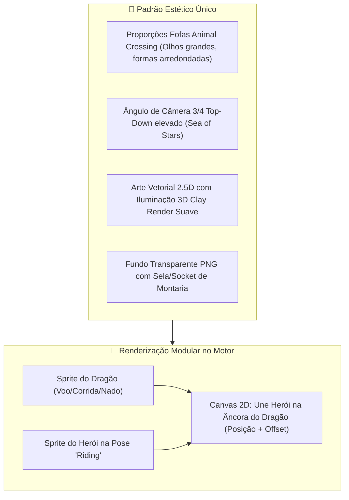
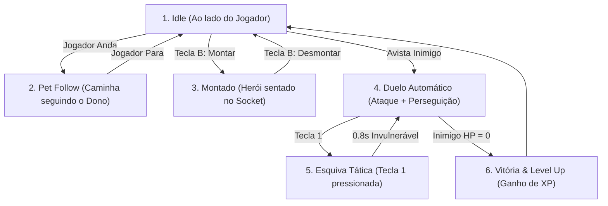

# 🐉 Catálogo Oficial de Dragões, Montarias e Prompts de Geração (Estilo Harmonizado)

> **Documento de Especificação de Espécies, Montarias, Companheiros e Sistema de Batalha**  
> **Diretriz Visual Unificada:** *Dragões no estilo estético de **Animal Crossing: New Horizons** (proporções fofas 'chibi', olhos grandes e expressivos, escamas/penas suaves com visual tátil), renderizados em **Perspectiva 3/4 Top-Down (ângulo de visão elevado estilo Sea of Stars)**. Acabamento em **Vector Art 2.5D com sombreamento suave, oclusão de ambiente e iluminação 3D / Clay Render** (NÃO é pixel art), com dorso nivelado adaptado para o **Sistema de Sockets de Montaria**.*

---

## 📋 Sumário de Categorias

1. [🎨 Arquitetura de Sockets e Harmonização Visual com os Heróis](#1-🎨-arquitetura-de-sockets-e-harmonização-visual-com-os-heróis)
2. [🦅 Categoria 1: Dragões Voadores (`dragon_fly_*`)](#2-🦅-categoria-1-dragões-voadores-dragon_fly_)
3. [🐾 Categoria 2: Dragões Terrestres (`dragon_land_*`)](#3-🐾-categoria-2-dragões-terrestres-dragon_land_)
4. [🌊 Categoria 3: Dragões Aquáticos (`dragon_water_*`)](#4-🌊-categoria-3-dragões-aquáticos-dragon_water_)
5. [✨ Categoria 4: Dragões Míticos / Arcanos (`dragon_mythic_*`)](#5-✨-categoria-4-dragões-míticos--arcanos-dragon_mythic_)
6. [⚔️ Guia de Animações, Estados de Combate e Barras de HP](#6-⚔️-guia-de-animações-estados-de-combate-e-barras-de-hp)

---

## 1. 🎨 Arquitetura de Sockets e Harmonização Visual com os Heróis

* **Prompt Base Style Tag para Dragões:**  
  `Animal Crossing New Horizons aesthetic, cute friendly mythical dragon companion mount, Sea of Stars high 3/4 top-down orthographic perspective, 2.5D vector illustration with smooth 3D clay lighting, soft ambient occlusion, cute expressive eyes, saddle area ready for rider, clean lines, isolated on transparent background, full body view`

---

## 2. 🦅 Categoria 1: Dragões Voadores (`dragon_fly_*`)

Os dragões voadores concedem a habilidade de **sobrevoar relevos, rios e obstáculos** quando montados.

---

### 2.1. `dragon_fly_zephyr` — Dragão dos Ventos Celeste
* **Tipo:** Voador / Ar
* **Efeito de Montaria:** Voo suave sobre terrenos intransponíveis com bônus de +25% de velocidade de movimento.
* **Esquiva Tática (Tecla `1`):** *Rajada de Vento* — Salto com pirueta aérea rápida, ficando invulnerável por 0.8s e criando um turbilhão que empurra inimigos.
* **Descrição Visual:** Dragãozinho alado esguio e adorável, escamas azul-celeste aveludadas, bochechas rosadas, asas fofas emplumadas brancas com pontas douradas e cauda com peninhas. Dorso com pequena sela de couro macio bege.
* **Prompt de Geração:**
  > `Cute sky wind dragon companion mount, Animal Crossing New Horizons in a flat vector art style, top-down camera angle, soft azure-blue velvety scales, adorable big amber eyes with rosy cheeks, fluffy white feathered wings with gold tips, feathered tail, soft leather rider saddle on back, clean 2.5D vector illustration, smooth 3D clay lighting, ambient occlusion, isolated on transparent background`

---

### 2.2. `dragon_fly_storm` — Dragão Tempestuoso do Trovão
* **Tipo:** Voador / Elétrico
* **Efeito de Montaria:** Voo planado com rastro de faíscas que ilumina áreas escuras da ilha.
* **Esquiva Tática (Tecla `1`):** *Teletransporte Elétrico* — Pisca em relâmpago 3 tiles para trás, deixando uma faísca que atordoa o atacante por 0.5s.
* **Descrição Visual:** Dragãozinho charmoso de escamas roxo-índigo, chifrinhos de raio azul-turquesa brilhante, asas translúcidas com textura gelatinosa e olhos ciano elétricos expressivos. Sela de couro preto e fivelas de prata.
* **Prompt de Geração:**
  > `Cute thunder storm dragon companion mount, Animal Crossing New Horizons aesthetic, high 3/4 top-down perspective like Sea of Stars, rich purple-indigo soft scales, cute glowing cyan lightning bolt horns, translucent electric wing membranes with soft sparks, expressive glowing eyes, dark leather riding saddle, clean vector art, soft 3D shading, isolated on transparent background`

---

### 2.3. `dragon_fly_solar` — Dragão Solar da Aurora
* **Tipo:** Voador / Luz
* **Efeito de Montaria:** Emite calor que acelera o crescimento de plantas e árvores por onde sobrevoa.
* **Esquiva Tática (Tecla `1`):** *Clarão Solar* — Emite um flash luminoso cegante que reduz a precisão dos dragões adversários em 50% por 3 segundos.
* **Descrição Visual:** Dragãozinho reluzente com escamas em degradê amarelo-ouro e laranja aurora, crista em leque como raios de sol, asas solares fofas e olhos dourados meigos. Sela vermelha real com detalhes de sol.
* **Prompt de Geração:**
  > `Cute solar dawn dragon mount, Animal Crossing New Horizons style, Sea of Stars 3/4 top-down orthographic angle, bright pastel yellow-gold scales, radiant peach and sunrise orange wing feathers, cute sun-crown crest on head, friendly warm eyes, crimson and gold rider saddle, clean 2.5D vector art with smooth 3D toy lighting, isolated on transparent background`

---

## 3. 🐾 Categoria 2: Dragões Terrestres (`dragon_land_*`)

Dragões terrestres são os mais robustos e amigáveis para correr pela ilha. Concedem **velocidade acelerada em terra e capacidade de quebrar rochas**.

---

### 3.1. `dragon_land_boulder` — Dragão de Rocha e Musgo
* **Tipo:** Terrestre / Terra
* **Efeito de Montaria:** Atropela e destrói pequenas pedras e arbustos automaticamente no caminho.
* **Esquiva Tática (Tecla `1`):** *Carapaça Blindada* — Encolhe-se como um tatu-bola de pedra, absorvendo 100% do dano do próximo golpe e refletindo 30% de volta.
* **Descrição Visual:** Dragãozinho bípede/quadrúpede compacto e rechonchudo, textura de pedra polida lisa cinza com placas de musgo verde no dorso e cauda arredondada. Olhos grandes cor de esmeralda e focinho fofo.
* **Prompt de Geração:**
  > `Cute chunky earth rock dragon mount, Animal Crossing New Horizons art style, high 3/4 top-down viewpoint like Sea of Stars, smooth rounded gray stone texture with lush green moss saddle pad, adorable blunt snout, big sparkling emerald eyes, round club tail, clean 2.5D vector illustration, soft 3D clay lighting, ambient occlusion, isolated on transparent background`

---

### 3.2. `dragon_land_magma` — Dragão Vulcânico de Lava
* **Tipo:** Terrestre / Fogo
* **Efeito de Montaria:** Imunidade a pisos de calor/lava e rastro ardente que espanta monstros menores.
* **Esquiva Tática (Tecla `1`):** *Explosão de Cinzas* — Desliza lateralmente soltando uma nuvem de fumaça preta e brasas que cancela o foco dos dragões inimigos.
* **Descrição Visual:** Dragãozinho carismático de obsidiana arredondada com barriga cor de pêssego/laranja e veios de magma brilhante suave. Patinhas com garras fofas e sela de ferro forjado acolchoada.
* **Prompt de Geração:**
  > `Cute volcanic magma dragon mount, Animal Crossing New Horizons aesthetic, Sea of Stars 3/4 top-down angle, rounded dark charcoal-slate scales with glowing soft orange warm belly and friendly lava freckles, small curved horns, cute fierce look, padded dark rider saddle, clean vector art with soft 3D lighting, isolated on transparent background`

---

### 3.3. `dragon_land_forest` — Dragão Guardião da Floresta
* **Tipo:** Terrestre / Natureza
* **Efeito de Montaria:** Caminhada furtiva na relva que aumenta a taxa de encontro de sementes e ovos raros.
* **Esquiva Tática (Tecla `1`):** *Salto Silvestre* — Salta para o lado deixando um toco de madeira ilusório que recebe o ataque no lugar dele.
* **Descrição Visual:** Dragãozinho quadrúpede verde-menta com chifrinhos de galhos de carvalho floridos, cauda de samambaia fofa e sela feita de cipó trançado e folhas acolchoadas.
* **Prompt de Geração:**
  > `Cute forest woodland dragon mount, Animal Crossing New Horizons style, high 3/4 top-down perspective like Sea of Stars, soft mint-green pastel scales, cute wooden antler horns with tiny pink flower buds, bushy fern tail, big doe eyes, woven floral vine rider saddle, clean 2.5D vector art, smooth 3D clay shading, isolated on transparent background`

---

## 4. 🌊 Categoria 3: Dragões Aquáticos (`dragon_water_*`)

Permitem navegar e surfar livremente por **rios, lagos e oceanos da ilha**.

---

### 4.1. `dragon_water_coral` — Dragão das Marés e Recifes
* **Tipo:** Aquático / Água
* **Efeito de Montaria:** Nado rápido e suave em águas profundas, com bônus de velocidade de pesca para o jogador.
* **Esquiva Tática (Tecla `1`):** *Mergulho Profundo* — Submerge na água por 1 segundo, reemergindo logo atrás do inimigo com uma borrifada d'água.
* **Descrição Visual:** Dragãozinho aquático serpentino fofo, escamas azul-turquesa acetinadas, barbatanas dorsais em formato de corais rosa-pastel, patinhas com membranas e sela de concha náutica.
* **Prompt de Geração:**
  > `Cute coral tide water dragon mount, Animal Crossing New Horizons art style, Sea of Stars high 3/4 top-down angle, silky turquoise-blue aquatic body, pastel pink coral fin frills along spine, webbed paws, friendly big eyes, pearlescent seashell rider saddle, clean 2.5D vector illustration, smooth 3D lighting, isolated on transparent background`

---

### 4.2. `dragon_water_frost` — Dragão Glacial dos Icebergs
* **Tipo:** Aquático / Gelo
* **Efeito de Montaria:** Congela temporariamente a superfície da água ao redor, criando plataformas de gelo efêmeras.
* **Esquiva Tática (Tecla `1`):** *Escudo de Gelo Estilhaçante* — Desliza em arco criando uma barreira de espinhos de gelo que repele projéteis.
* **Descrição Visual:** Dragãozinho ártico de escamas brancas fofas com pequenos espinhos de cristal de gelo translúcido arredondado e cauda em floco de neve. Sela de lã azul-inverno.
* **Prompt de Geração:**
  > `Cute arctic frost ice dragon mount, Animal Crossing New Horizons aesthetic, Sea of Stars 3/4 top-down view, soft pure-white scales, smooth rounded translucent ice spikes on back, snowflake tail tip, big sapphire blue eyes, winter knitted blue saddle pad, clean vector art, soft 3D clay shading, isolated on transparent background`

---

### 4.3. `dragon_water_abyss` — Dragão Abissal Bioluminescente
* **Tipo:** Aquático / Sombra
* **Efeito de Montaria:** Visão perfeita em águas escuras e capacidade de encontrar baús submersos.
* **Esquiva Tática (Tecla `1`):** *Pulso de Névoa Abissal* — Libera tinta bioluminescente brilhante que desorienta os inimigos.
* **Descrição Visual:** Dragãozinho arredondado azul-marinho com pequenas pintinhas neon ciano brilhantes, anteninha fofa luminescente na testa e olhos expressivos brilhantes. Sela de couro marinho.
* **Prompt de Geração:**
  > `Cute deep ocean bioluminescent dragon mount, Animal Crossing New Horizons style, high 3/4 top-down perspective like Sea of Stars, dark navy and plum scales with glowing cyan bioluminescent freckles, cute round glowing angler lure on head, big gentle eyes, snug rider saddle, clean 2.5D vector art, smooth 3D lighting, isolated on transparent background`

---

## 5. ✨ Categoria 4: Dragões Míticos / Arcanos (`dragon_mythic_*`)

---

### 5.1. `dragon_mythic_lua` — Dragão Guardião da Ilha Lua
* **Tipo:** Mítico / Arcano & Estelar
* **Efeito de Montaria:** Híbrido Supremo — Voo livre, corrida veloz em terra e nado oceânico.
* **Esquiva Tática (Tecla `1`):** *Dobra Temporal Lua* — Desacelera o tempo ao redor do jogador em 50% por 1.5s.
* **Descrição Visual:** Dragão majestoso e adorável de escamas prateadas reluzentes, runas amarelas suaves da linguagem Lua no corpo, chifres de lua crescente e cauda com brilho estelar. Sela real dourada com almofada de veludo azul-noite.
* **Prompt de Geração:**
  > `Cute legendary Celestial Moon Dragon mount, Animal Crossing New Horizons aesthetic, Sea of Stars 3/4 top-down camera perspective, shimmering silver-white soft scales, glowing pastel yellow Lua script runic markings, crescent moon horns, stardust tail effect, royal midnight-blue and gold velvet saddle, clean 2.5D vector illustration, master quality 3D clay lighting, isolated on transparent background`

---

## 6. ⚔️ Guia de Animações, Estados de Combate e Barras de HP

### 6.1. Máquina de Estados de Combate e Interação de Montaria

---

## 🔗 Links Relacionados
* [[Mount & Modular Character Layering System]]
* [[Catalog - Characters, NPCs & Generation Prompts]]
* [[00 - High Concept & Game Vision]]
* [[Keyboard Shortcuts & Controls Cheatsheet]]
