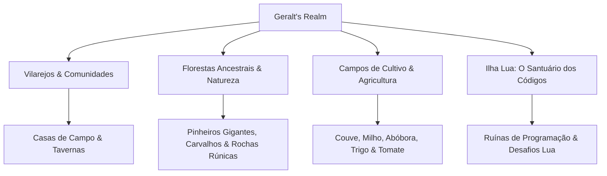

# 🏰 Geralt's Realm Lore & Setting

#lore #worldbuilding #gamedesign #fantasy

---

## 📖 O Reino de Geralt (Geralt's Realm)
**Geralt's Realm** é um universo de fantasia medieval lúdica que combina estética nostálgica de RPG 2D clássico (pixel art refinada em 64x64) com mecânicas modernas de edição de mundos em tempo real e expansão online massiva.

---

## 🌟 Pilares de Design
1. **Expressão e Criação Sem Limites**: O mundo não tem limites rígidos de borda; cada jogador pode expandir seu vilarejo infinitamente.
2. **Harmonia Visual e Profundidade**: Uso de sombras elípticas dinâmicas, água animada contínua e sobreposição de camadas para criar sensação de vida orgânica.
3. **Ponte para o Conhecimento**: Conexão direta com a **Ilha Lua**, onde magias e construções são invocadas através de pensamento computacional e lógica de blocos.

---

## 🔗 Links Relacionados
* [[Tile Assets & Biome Catalog]]
* [[Characters, NPCs & Entities]]
* [[Lua Island Educational Gameplay (Blockly & Lua)]]
