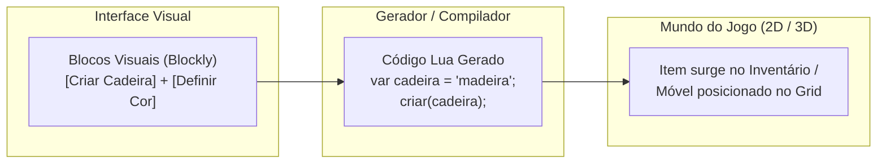

# 🏝️ Lua Island Educational Gameplay (Blockly & Lua)

#gamedesign #education #blockly #lua #pedagogy #mmo

> **Documento de Origem**: [`planejamento_ilha_lua.md`](file:///Volumes/SSD%20FN501%20PRO/KidsLean/planejamento_ilha_lua.md)

---

## 🎯 Conceito Central
Um MMO educativo rodando no navegador onde os jogadores exploram uma ilha compartilhada, constroem suas casas e realizam atividades (pesca, coleta, agricultura) resolvendo desafios de **Pensamento Computacional** através de uma interface de blocos visuais (*Google Blockly*) que gera código **Lua** executável.

---

## 📈 Trilha Progressiva de Aprendizado

| Nível | Conceito de Programação | Objetivo no Jogo | Exemplo de Código Lua Gerado |
| :---: | :--- | :--- | :--- |
| **1** | **Instanciar & Variáveis** | Obter o primeiro móvel para a casa | `var cadeira = "madeira"; criar(cadeira);` |
| **2** | **Condicionais (If/Else)** | Pescar um peixe ou capturar inseto | `se (mouse_clicado e peixe_perto) entao capturar(); senao esperar();` |
| **3** | **Matemática & Operadores** | Somar recursos para upgrade da casa | `se (madeira >= 10 e pedra >= 5) entao evoluirCasa();` |
| **4** | **Laços de Repetição (Loops)** | Plantar fileiras de árvores ou cercas | `para i de 1 ate 8 faca criar("cerca", i);` |
| **5** | **Funções & Modularização** | Automação de rega na agricultura | `funcao regarCanteiro(pos) ... fim;` |
| **6** | **Listas & Iteração (Foreach)** | Organização de inventário e tinturas | `para cada item em inventario faca pintar(item, "azul");` |

---

## 🔗 Links Relacionados
* [[Web MMO Client-Server Architecture]]
* [[Milestones & Sprint Roadmap]]
* [[Geralt's Realm Lore & Setting]]
