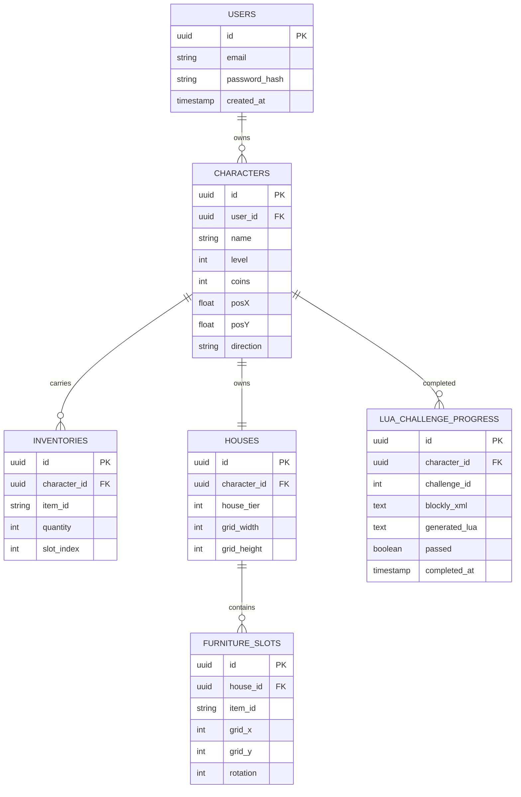

# 🗄️ Database & Account State Schema

#database #schema #sql #nosql #mmo #persistence

---

## 📊 Modelagem de Entidades Relacionais

---

## 🔗 Links Relacionados
* [[Web MMO Client-Server Architecture]]
* [[Lua Island Educational Gameplay (Blockly & Lua)]]
* [[State Persistence & Auto-Save Protocol]]
