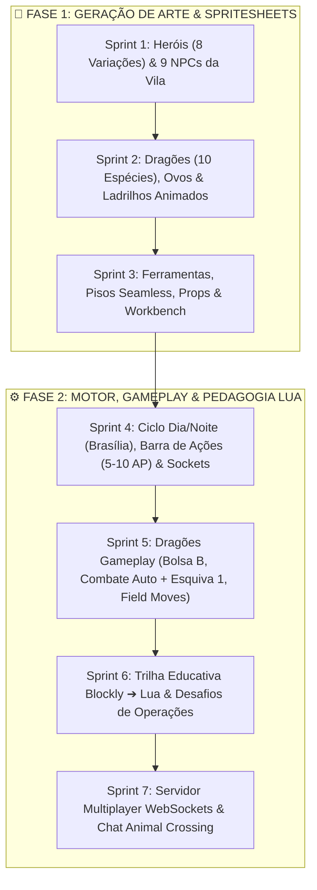

# 🚀 Milestones & Sprint Roadmap (7 Sprints)

#roadmap #sprints #scrum #planning #milestones

> **Estratégia de Desenvolvimento:** As **primeiras 3 Sprints** são 100% dedicadas à geração e processamento de todos os assets visuais, animações, dragões e tilesets. As **Sprints 4 a 7** implementam o motor de jogo, ciclograma dia/noite com barra de ações, dragões, trilha educativa Lua e multiplayer em tempo real.

---

## 📅 Visão Geral das 7 Sprints

---

## 🎯 Detalhamento dos Sprints

### 🎨 Sprint 1 — Arte & Sprites: Heróis, NPCs & Animações
* [x] Spritesheets dos 8 Heróis Jogáveis (Lobo, Morcego, Águia, Gato - Masc/Fem).
* [x] Poses e animações: `Idle`, `Walk 4-way`, `Run [Shift] 4-way`, `Craft` e `Mount Riding`.
* [x] Sprites e perfis dos 9 NPCs Moradores da Vila Medieval.

### 🐉 Sprint 2 — Arte & Sprites: Dragões, Ovos & Ladrilhos Animados
* [x] Spritesheets dos Dragões Voadores (Ventos, Tempestade, Solar) com área de sela.
* [x] Spritesheets dos Dragões Terrestres (Rocha, Magma, Floresta) com área de sela.
* [x] Spritesheets dos Dragões Aquáticos (Marés, Glacial, Abissal) com área de sela.
* [x] Spritesheet do Dragão Mítico Astra da Ilha Lua.
* [x] Ícones de Ovos de Dragão, Ninho Incubador e Apito de Chamado.
* [x] Spritesheets em Loop Animado (Água Cristalina, Lava, Cachoeira, Fogueira).

### 🛠️ Sprint 3 — Arte & Sprites: Ferramentas, Tilesets & Workbench
* [x] Ícones das Ferramentas (Pá, Machado, Vara de Pesca, Picareta, Regador, Rede).
* [x] Tilesets de Terreno Seamless (Paralelepípedo, Terra, Madeira, Grama Florida, Areia, Mosaico).
* [x] Props de Mobília, Tendas, Casas de Enxaimel, Pontes, Rampas, Escadas, Cercados e Poço.
* [x] Assets de Sementes, Árvores Adultas e Rochas Minerais.

### ☀️🌙 Sprint 4 — Core Engine: Ciclo Dia/Noite, Barra de Ações & Sockets
* [x] Sistema de Ciclo Dia/Noite sincronizado com Horário de Brasília (Dia: 06h às 17h / Noite: 17h01 às 05h59).
* [x] Sistema de Barra de Pontos de Ação (5 APs iniciais, evoluindo até 10 APs) que bloqueia ações ao zerar.
* [x] Mecânica Exclusiva do Morcego Vampiro: Ganha +5 Ações Noturnas exclusivas para craft no escuro.
* [x] Tela de Seleção dos 8 Heróis com ativação das Habilidades Passivas.
* [x] Motor de Sockets de Montaria no Canvas 2D (`MountSocketManager`).
* [x] UI de Diálogos estilo Animal Crossing (balões orgânicos creme, badges e som Animalese).

### 🐲 Sprint 5 — Dragões: Bolsa B, Combate & Field Moves
* [x] Bolsa de Dragões (Atalho `B`) para invocação e montaria rápida (10 Espécies Oficiais).
* [x] Pet Follow AI (máquina de estados do dragão seguindo o herói suavemente).
* [x] Sistema de Combate Automático com barras de HP flutuantes e Esquiva Tática (Tecla `1`).
* [x] Field Moves de Interação no Cenário (Quebrar pedras, criar gelo na água, apagar fogo, germinar grama).
* [x] Ninhos de Ovos na Natureza e Sistema de Eclosão (Liberar na Natureza vs Adotar e Treinar).

### 🎓 Sprint 6 — Trilha Educativa: Blockly ➔ Lua & Workbench
* [x] Integrar Google Blockly / Estúdio de Código como Modal HUD de Programação (Tecla `K`).
* [x] Transpilador Blockly para Código Lua Limpo com visualização de código e console interativo.
* [x] Roteiro Pedagógico Lua (6 Lições): Variáveis, Condicionais, Matemática de Forja, Laços For, Funções e Field Moves.
* [x] Sistema de Missões com NPCs Mentores (Dr. Arquimedes, Brutus, Flora e Mestre Casco).
* [x] Sistema de Ferramentas Ativas e Bancada de Trabalho Workbench.

### 🌐 Sprint 7 — Multiplayer: WebSockets, Sincronização & Chat Animal Crossing
* [x] Servidor Node.js + WebSockets de baixa latência para a Ilha Compartilhada (`server/multiplayer-server.js`).
* [x] Sincronização em Tempo Real de Jogadores, Montarias e Dragões Ativos via LERP (`MultiplayerClient.js`).
* [x] Sistema de Chat em Tempo Real com Balões de Fala Empilháveis e Auto-Fade.
* [x] Bots amigáveis de demonstração offline para experiência viva standalone.

---

## 🔗 Links Relacionados
* [[Day Night Cycle & Action Points System]]
* [[Mount & Modular Character Layering System]]
* [[Lua Missions Script & Interactive Field Moves]]
* [[Dialogue & Animal Crossing Speech Bubble System]]
