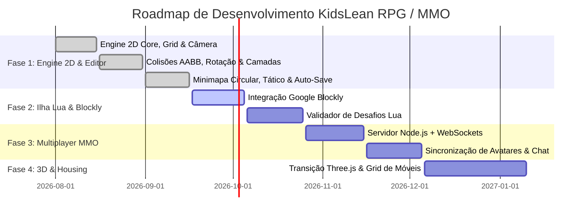

# 🚀 Milestones & Sprint Roadmap

#roadmap #sprints #scrum #planning #milestones

---

## 📅 Visão Geral dos Sprints

---

## 🎯 Detalhamento dos Sprints

### ✅ Sprint 1 & 2: 2D Engine & World Editor (Concluído)
* [x] Loop de 60 FPS com delta time e zoom.
* [x] TileMap esparso infinito com 4 camadas configuráveis.
* [x] Sistema de rotação de 90°/180°/270° com recálculo de colisão.
* [x] Ajuste de escala de personagens e gizmos de colisor.
* [x] Minimapa circular com bússola e mapa tático expandido.
* [x] Persistência automática multi-chave no localStorage.

### 🟡 Sprint 3: Integração Educativa Blockly ➔ Lua (Próximo)
* [ ] Integrar editor visual de blocos Google Blockly como overlay modal.
* [ ] Customizar blocos com a semântica do jogo (`CriarItem`, `Pescar`, `Regar`).
* [ ] Desenvolver o validador de lógica de programação para liberação de itens.

### 🔵 Sprint 4 & 5: Servidor Multiplayer & Comunidade
* [ ] Configurar servidor Node.js + Socket.io com tick rate de 20 Hz.
* [ ] Sincronizar movimentação de múltiplos jogadores e balões de fala/emojis.
* [ ] Gerenciar estado global da ilha (coleta de recursos sincronizada).

---

## 🔗 Links Relacionados
* [[Lua Island Educational Gameplay (Blockly & Lua)]]
* [[Web MMO Client-Server Architecture]]
* [[Multiplayer Synchronization (WebSockets)]]
