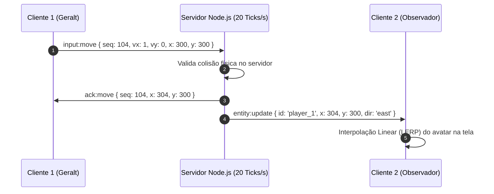

# 📡 Multiplayer Synchronization (WebSockets)

#mmo #networking #websockets #synchronization #multiplayer

---

## 🎯 Protocolo de Sincronização em Tempo Real
Para garantir que dezenas de avatares se movimentem de maneira fluida e sem teleportes aparentes:



---

## 📦 Formato dos Pacotes de Rede (JSON / Binary)

```json
// Pacote de Movimento do Jogador (Cliente -> Servidor)
{
  "t": "MOVE",
  "seq": 142,
  "x": 384,
  "y": 512,
  "dir": "south-east",
  "moving": true
}

// Broadcast de Estado da Ilha (Servidor -> Clientes a cada 50ms)
{
  "t": "WORLD_TICK",
  "tick": 8940,
  "players": [
    { "id": "p1", "x": 384, "y": 512, "dir": "south-east", "anim": "running" },
    { "id": "p2", "x": 120, "y": 200, "dir": "south", "anim": "idle" }
  ]
}
```

---

## 🔗 Links Relacionados
* [[Web MMO Client-Server Architecture]]
* [[Player Entity & 8-Way Movement]]
* [[Database & Account State Schema]]
