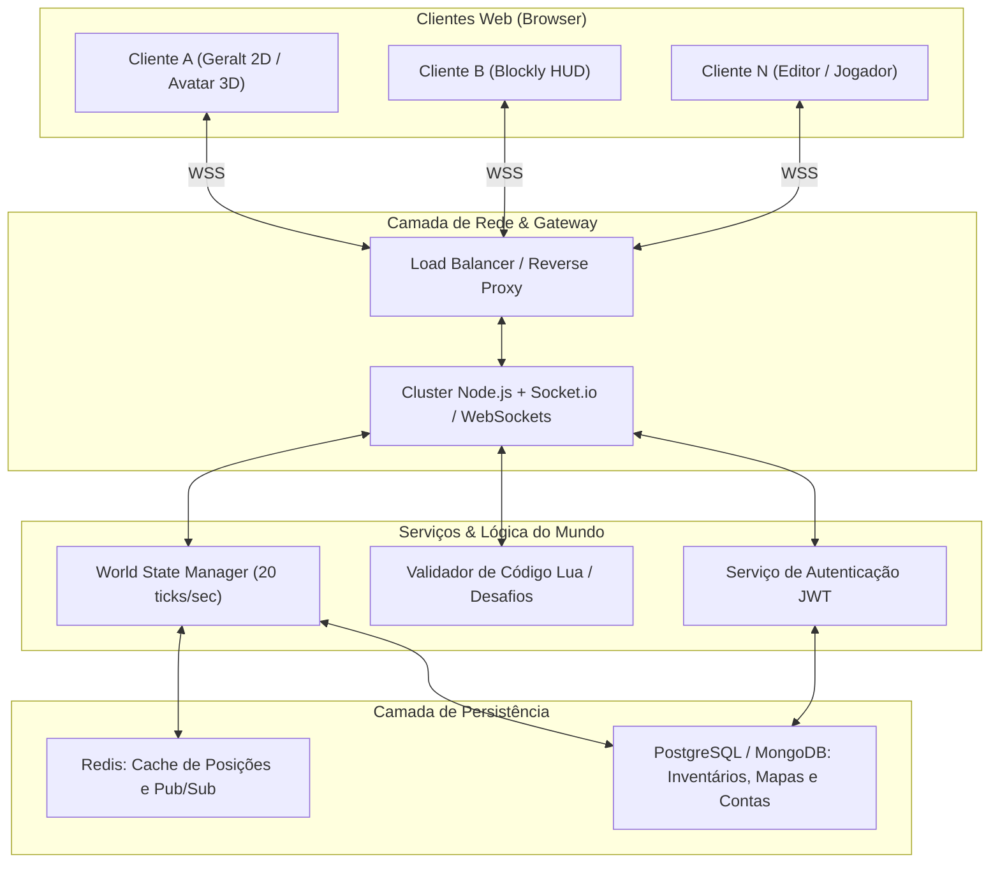

# 🌐 Web MMO Client-Server Architecture

#architecture #mmo #websockets #backend #database #server

---

## 🏗️ Topologia da Arquitetura

---

## ⚡ Pilhas Tecnológicas
* **Frontend**: Vanilla JS / Three.js / Canvas 2D + Google Blockly.
* **Backend de Rede**: Node.js + Socket.io (ou uWebSockets.js para alta performance).
* **Banco de Dados**: PostgreSQL para contas e inventários; MongoDB para estruturas de mapas JSON.
* **Cache em Memória**: Redis para sincronização de instâncias e chat em tempo real.

---

## 🔗 Links Relacionados
* [[Multiplayer Synchronization (WebSockets)]]
* [[Database & Account State Schema]]
* [[Milestones & Sprint Roadmap]]
