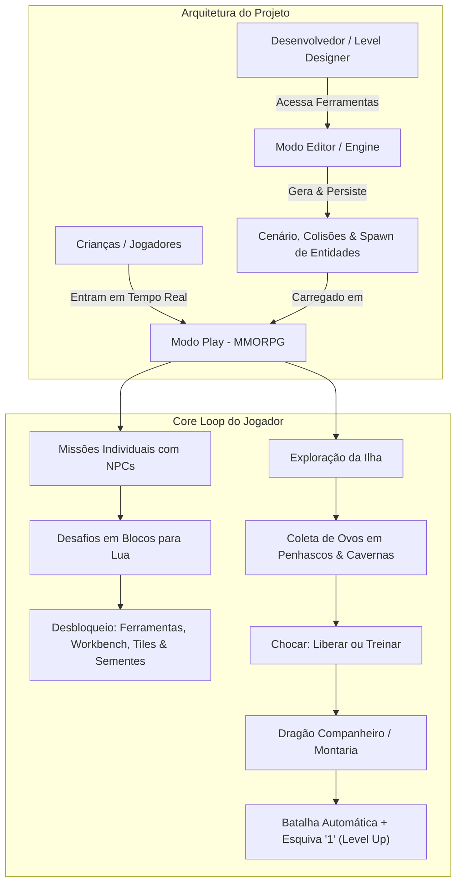
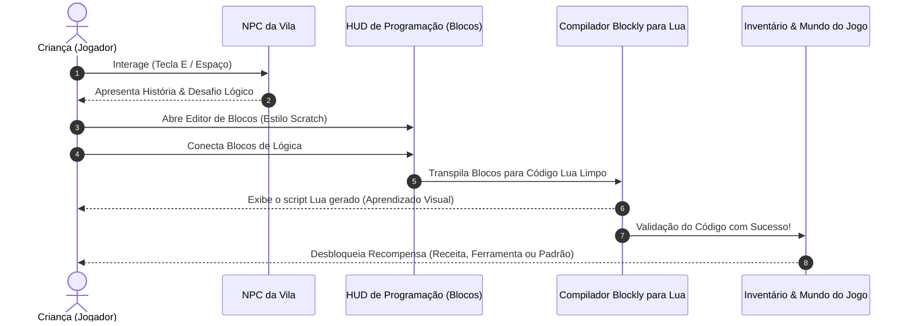
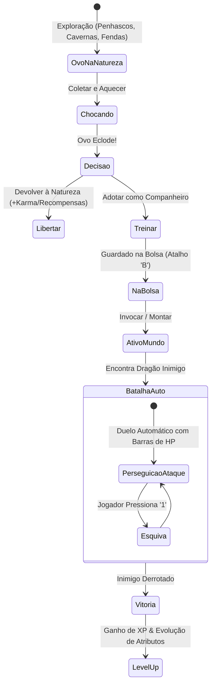
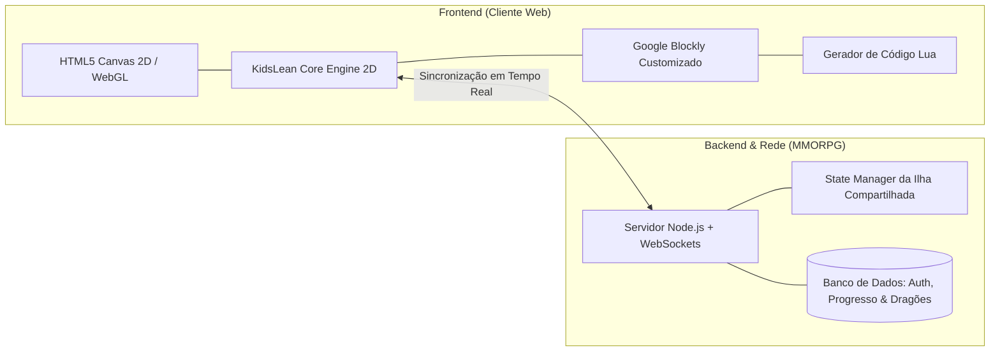

# 🐉 High Concept: KidsLean / Ilha Lua — RPG & MMORPG Educativo

> **Gênero:** MMORPG Infantil / Simulação de Vida Medieval / EdTech  
> **Inspirações:** *Animal Crossing: New Horizons*, *Dragon Quest Builders*, *Scratch*, *Tibia/Pokemon Companion System*  
> **Plataforma:** Web (Navegadores Desktop / Tablets)  
> **Público-Alvo:** Crianças e Jovens Estudantes (6 a 14 anos) & Educadores  

---

## 1. 🌟 Resumo Executivo & Visão do Jogo

O **KidsLean (Ilha Lua)** é um MMORPG medieval lúdico e educativo que combina a liberdade de exploração e convivência comunitária de *Animal Crossing* com a fascinação da domesticação e combate de dragões, movido por um motor de **aprendizado de programação em blocos (gerando código Lua)**.

O projeto opera sob uma arquitetura de dois modos rigorosamente separados:
1. **Modo Editor (Engine / Dev Only):** Ambiente restrito ao desenvolvedor para criação de mundos, pintura de biomas, desenho de colisões e posicionamento de entidades.
2. **Modo Play (MMORPG Sandbox):** O jogo real, onde crianças exploram a mesma ilha em tempo real, interagem com NPCs, resolvem desafios individuais de programação para desbloquear construções, coletam ovos e treinam dragões.

---

## 2. 🕹️ Os Dois Modos de Operação

### 2.1. 🛠️ Modo Editor (Ferramenta do Desenvolvedor)
* **Finalidade:** Funcionar como uma Game Engine integrada no navegador.
* **Acesso:** Exclusivo do desenvolvedor (bloqueado em builds de produção para jogadores).
* **Funcionalidades:**
  * Pincel, balde de preenchimento e posicionamento multi-tile de estruturas.
  * Pipeline de rotação de pegada (0°, 90°, 180°, 270°).
  * Criação e ajuste visual de caixas de colisão AABB (Gizmos interativos).
  * Definição de pontos de spawn de NPCs, monstros, pontos de mineração e ninhos de ovos de dragão.
  * Configuração de camadas de renderização (Chão, Decoração, Sólido, Personagens).

### 2.2. 🎮 Modo Play (Experiência das Crianças)
* **Finalidade:** O ambiente vivo do MMORPG medieval.
* **Mundo Compartilhado em Tempo Real:** Vários jogadores navegam pela mesma ilha, veem seus avatares e seus dragões companheiros simultaneamente.
* **Segurança & Foco:** Os jogadores **não possuem acesso** às ferramentas de edição do cenário. Toda modificação que o jogador faz no mundo (plantar sementes, colocar pontes ou cercados) ocorre via mecânicas legítimas do jogo desbloqueadas através das missões.

---

## 3. 📜 Sistema de Missões e Trilha Educativa (Lua em Blocos)

### 3.1. Progressão Individual Assíncrona
* Todos os jogadores compartilham o mesmo espaço físico na ilha, porém a **progressão de missões é estritamente pessoal**.
* Dois jogadores conversando com o mesmo NPC podem receber a etapa correspondente ao seu próprio progresso (ex: o Jogador A está na Missão 2 aprendendo *Condicionais*, enquanto o Jogador B está na Missão 7 aprendendo *Loops*).
* Não há bloqueio ou dependência entre jogadores para cumprir a trilha educativa principal.

### 3.2. Metodologia: Do Bloco ao Código Lua
As crianças constroem algoritmos encaixando blocos visuais intuitivos. Simultaneamente, uma aba lateral exibe a sintaxe real em **Lua** sendo gerada, facilitando a transição cognitiva para código textual.

| Nível / Missão | Conceito de Programação | Exemplo em Lua | Recompensa Desbloqueada |
| :--- | :--- | :--- | :--- |
| **Missão 1** | Chamada de Funções & Variáveis | `meu_chao = "terra_batida"` `aplicar(meu_chao)` | **Padrões de Chão** (Caminhos de pedra, terra, grama florida) |
| **Missão 2** | Tipos de Dados & Equipamentos | `equipar("pa")` | **Ferramentas Básicas** (Pá, Machado de Lenhador, Vara de Pesca) |
| **Missão 3** | Condicionais (`if / then / else`) | `if energia >= 5 then` &nbsp;&nbsp;`cortar_arvore()` `end` | **Sementes & Agricultura** (Mudas de carvalho, pinheiros, arbustos e flores) |
| **Missão 4** | Laços de Repetição (`for / while`) | `for i=1, 6 do` &nbsp;&nbsp;`construir("cerca", i)` `end` | **Workbench - Estruturas** (Cercados, Pontes de Madeira, Escadas, Rampas) |
| **Missão 5** | Funções Customizadas & Parâmetros | `function erguer_abrigo(tipo)` &nbsp;&nbsp;`craft(tipo)` `end` | **Workbench - Habitação** (Cama, Cadeira, Tenda, Casa Medieval) |
| **Missão 6** | Manipulação de Eventos & Física | `on_water_flow(function()` &nbsp;&nbsp;`ativar_correnteza()` `end)` | **Padrões Animados** (Ladrilhos de Água Corrente, Lava Vulcânica) |

---

## 4. 🐉 Sistema de Dragões (Companheiros, Montarias & Batalhas)

Os dragões são o elemento central de fantasia e conquista do jogo. Cada dragão possui temperamento, espécie e habilidades únicas.

### 4.1. Tipos de Dragões & Montarias
* 🦅 **Dragões Voadores:** Permitem sobrevoar obstáculos, penhascos e rios da ilha.
* 🐾 **Dragões Terrestres:** Alta velocidade de locomoção em terra e capacidade de abrir caminhos em rochas.
* 🌊 **Dragões Aquáticos:** Permitem navegar em rios, lagos e no mar que cerca a ilha.

### 4.2. Coleta de Ovos & Chocagem
* Os ovos são encontrados organicamente pelo mapa em locais de difícil acesso (topo de penhascos, profundezas de cavernas e buracos no chão cavados com a pá).
* Ao chocar o ovo, o jogador tem uma escolha moral e estratégica:
  1. **Liberar na Natureza:** O dragão ganha liberdade e concede bênçãos ecológicas ou sementes raras.
  2. **Adotar e Treinar:** O dragão se torna seu companheiro oficial.

### 4.3. A Bolsa de Dragões (Tecla `B`)
* Ao pressionar **`B`**, o jogador abre a bolsa/estábulo portátil.
* Permite selecionar qual dragão acompanhará o avatar ou montá-lo diretamente.
* O dragão ativo segue o jogador pelo mapa com física suave de acompanhamento (pet follow AI).

### 4.4. Sistema de Combate & Treinamento
* **Combate Automático Dinâmico:** Ao avistar ou se aproximar de dragões selvagens ou rivais, o dragão do jogador assume postura de combate, persegue o alvo e desfere ataques automaticamente.
* **Suporte Multi-Inimigo:** Pode haver 1 ou mais dragões inimigos na mesma peleja.
* **Barras de Vida (HP Bars):** Indicadores visuais de vida flutuam em tempo real acima da cabeça de todos os dragões engajados na batalha.
* **Interação Tática em Tempo Real (Tecla `1` - Esquiva):** A qualquer momento durante a batalha automática, o jogador pode apertar a tecla **`1`** para comandar uma esquiva rápida e precisa, desviando de ataques fortes e virando o rumo da luta.
* **Evolução & Level Up:** Ao derrotar adversários, o dragão recebe Pontos de Experiência (XP), sobe de nível, aumenta seu HP máximo, dano de ataque e pode desbloquear novas aparências.

---

## 5. 🎹 Mapeamento de Controles do Jogador (Play Mode)

| Tecla / Ação | Função | Contexto |
| :---: | :--- | :--- |
| **W, A, S, D** / **Setas** | Movimentação 8 direções do personagem | Exploração |
| **E** / **Espaço** | Interagir com NPCs, coletar itens e abrir baús | Mundo |
| **B** | Abrir Bolsa de Dragões (Invocar / Montar / Guardar) | HUD Geral |
| **1** | Comando de **Esquiva Tática** do Dragão | Durante Batalha |
| **I** | Abrir Inventário de Itens, Sementes e Ferramentas | HUD Geral |
| **C** | Abrir Bancada de Trabalho / Menu de Construção (Workbench) | Criação |
| **M** / **Tab** | Alternar Minimapa Circular / Mapa Tático Expandido | Navegação |

---

## 6. 🏗️ Arquitetura Técnica & Stack Resumida

* **Motor Gráfico:** 2D Sparse Grid TileMap com renderização acelerada por Canvas/WebGL, suporte a camadas dinâmicas e animações cíclicas (água/lava).
* **Camada Educativa:** Interface visual de blocos (estilo Blockly/Scratch) com transpilador em tempo real para scripts **Lua**.
* **Rede Multiplayer:** WebSockets de baixa latência para sincronização de avatares, dragões visíveis e chat moderado.
* **Persistência:** Salvamento contínuo de progresso de missões individuais, inventário e dados dos dragões domesticados.
